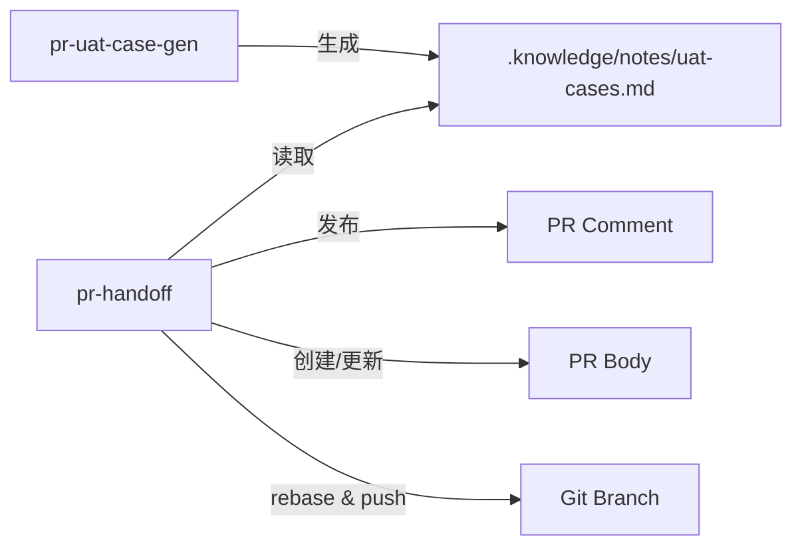

# PR Handoff Skills (pr-handoff + pr-uat-case-gen) 重构设计

## 概述

对两个 MagicDoor GitHub PR 工作流 skill 进行架构重构，消除遗留的 regression doc 概念，引入 UAT cases PR comment 模式，统一 base branch 检测，完善 pre-push checks。

## 背景与动机

### 问题来源

原 `pr-handoff`（原 `magicdoor-pr-regression-handoff`）skill 存在几个问题：

1. **Regression doc 概念累赘**：自动生成的 regression test doc 文件需要写入仓库、commit、维护更新链接——但 QA 团队实际依赖的是 UAT cases
2. **Marker 驱动的 PR body 生成脆弱**：`REGRESSION_DOC_HERE` marker 替换逻辑耦合在 PR body 中，update 时"整体替换"会擦掉手动编辑
3. **Base branch 硬编码 `origin/master`**：部分仓库使用 `main`，导致 rebase/diff 出错
4. **Pre-push checks 不支持 Rush monorepo**：多个 `package.json` 导致检测错误
5. **两个 skill 无协作关系**：各自独立运行，`pr-uat-case-gen` 输出到 `.knowledge/notes/plans/`，`pr-handoff` 不知道它的存在

### 设计目标

1. **消除 regression doc 概念**：不再生成 regression doc 文件
2. **UAT cases 走 PR comments**：不嵌入 body，避免冲掉手动编辑
3. **统一的 base branch 检测**：用 `git remote show origin | grep "HEAD branch"` 替代 `origin/master`
4. **两个 skill 协作**：`pr-uat-case-gen` 生成临时文件 → `pr-handoff` 读取并发布
5. **Rush monorepo 兼容**：检测 `rush.json` 后跳过 format/lint/type-check
6. **Auto-commit 保留**：LLM 自动生成 commit message 直接 commit

## 架构设计

### 关系图



### 职责边界

| Skill | 职责 | 不做什么 |
|-------|------|----------|
| `pr-uat-case-gen` | diff 分析、base branch 验证、UAT cases 生成、输出到 `.knowledge/notes/uat-cases.md` | 不操作 GitHub、不 push、不创建/更新 PR |
| `pr-handoff` | base branch 检测、rebase、pre-push checks、push、PR 创建/更新、UAT cases comment 发布 | 不分析 diff scope、不生成测试用例 |

### 文件路径约定

| 路径 | 用途 | 生命周期 |
|------|------|----------|
| `.knowledge/notes/uat-cases.md` | 当前分支的 UAT cases | 每次 `pr-uat-case-gen` 运行覆盖写入；`pr-handoff` 读取后保留 |

`.knowledge/notes/` 路径说明：相对于项目仓库根目录，位于 `.knowledge/notes/` 标准 notes 目录下，被 Git 跟踪（不属于 `.gitignore`）。两个 skill 的 LLM agent 都在项目根目录运行，因此路径为项目相对的 `./.knowledge/notes/uat-cases.md`。

## 详细设计

### 1. Description

**pr-handoff:**
```yaml
description: >-
  Use when a feature branch is ready for creating a new PR or updating an
  existing PR with QA handoff documentation.
```

**pr-uat-case-gen**（原 `magicdoor-pr-uat-cases`）:
```yaml
description: |
  Use when a feature branch needs UAT test cases derived from its actual diff
  scope, before QA handoff or PR review. Triggered by requests to "write UAT
  cases", "generate test cases from diff", or when preparing regression
  documentation for a frontend PR.
```

### 2. Base Branch 统一检测

所有 workflow 统一使用以下逻辑（定义在 SKILL.md 的 pre-step 中）：

```bash
BASE_BRANCH=$(git remote show origin | grep "HEAD branch" | awk '{print $NF}')
```

行为：
- 输出结果如 `main` 或 `master`
- 后续所有 `origin/master` 引用替换为 `origin/$BASE_BRANCH`
- `pr-uat-case-gen` 的 Step 1 也使用相同逻辑（已有，不需要变更）

### 3. SKILL.md 流程

```mermaid
flowchart TD
    A[开始] --> B[Pre-step: git status]
    B --> C{有未提交变更?}
    C -->|是| D[git add + git commit\nLLM 生成 message]
    C -->|否| E[Pre-step: 检测 BASE_BRANCH]
    D --> E
    E --> F[git fetch origin BASE_BRANCH]
    F --> G[git rebase origin/BASE_BRANCH]
    G --> H{冲突?}
    H -->|是| I[STOP: 要求用户手动解决]
    H -->|否| J[Auto-detect: gh pr view]
    J --> K{PR 状态?}
    K -->|OPEN| L[执行 Update PR Flow 节]
    K -->|MERGED/CLOSED/无 PR| M[执行 Create PR Flow 节]

#### 冲突处理
冲突时 STOP，要求用户手动解决。用户解决后，询问哪些文件冲突及如何解决，记录用于 PR body。

### 4. Create PR Flow（SKILL.md 内联节）

原 8 步 → 简化为 6 步。作为 SKILL.md 中的独立 section，被 dispatch 流程引用。

1. **Analyze Changes** — `git log`, `git diff --stat`, `git diff --name-only` vs `origin/$BASE_BRANCH`
2. **Pre-push Checks** — 执行 Pre-push Checks 节，含 Rush 检测
3. **Push Branch** — `git push origin {branch}`
4. **Create PR** — 检测 PR template → 作为 body 基础 → 追加 summary/file-changes/where-to-test/edge-cases → `gh pr create`
5. **UAT Cases Comment** — LLM 自行判断（根据 diff 中的 `.tsx`/`.jsx` 文件、`package.json` 中的前端框架依赖等）是否为前端项目：
   - **非前端** → 跳过所有 UAT 操作，不报 warning，不删旧 comment
   - **前端** → **必须先执行 `pr-uat-case-gen` skill 生成 `.knowledge/notes/uat-cases.md`**（硬 gate，不可跳过），然后：
     - `.knowledge/notes/uat-cases.md` 存在且非空 → `gh pr comment $PR_NUMBER --body "# UAT Test Cases\n\n$(cat .knowledge/notes/uat-cases.md)\n\n<!-- uat-cases:{{feature-slug}} -->"`
     - 存在但为空 → 跳过（不创建无意义的空 comment）
     - 不存在 → 视为 UAT skill 执行失败，输出 warning `"[WARN] pr-uat-case-gen failed to produce .knowledge/notes/uat-cases.md. UAT comment skipped."`，不阻塞 PR 流程
6. **Verify** — `gh pr view --json number,title,url,updatedAt`

移除的内容：
- `REGRESSION_DOC_HERE` marker 检测和替换
- Regression doc 创建和 commit（原 Step 3-4）
- Docs path 解析（原 Step 2）

### 5. Update PR Flow（SKILL.md 内联节）

原 8 步 → 简化为 6 步。作为 SKILL.md 中的独立 section，被 dispatch 流程引用。

1. **Analyze Changes** — 分析 `origin/$BASE_BRANCH..HEAD`（全量）和 `origin/{branch}..HEAD`（增量）
2. **Pre-push Checks** — 执行 Pre-push Checks 节
3. **Push Branch** — `git push origin {branch}`
4. **Update PR Body** — 重建 body（template + 当前状态），`gh pr edit $PR_NUMBER --body-file ...`
5. **UAT Cases Comment** — LLM 自行判断是否为前端项目：
   - **非前端** → 跳过所有 UAT 操作，不报 warning，不删旧 comment
   - **前端** → **必须先执行 `pr-uat-case-gen` skill**（硬 gate，重新生成覆盖 `.knowledge/notes/uat-cases.md`），然后：
     - `.knowledge/notes/uat-cases.md` 存在且非空 → 查询已有 comment（含 `<!-- uat-cases:{{feature-slug}} -->` marker）→ PATCH 更新或新建
     - 存在但为空/全空白且有旧 comment → **删除**旧 comment
     - 存在但为空/全空白且无旧 comment → 跳过
6. **Verify** — `gh pr view $PR_NUMBER --json number,title,body,updatedAt`

移除的内容：
- `REGRESSION_DOC_HERE` marker 检测和替换
- Regression doc 增量更新和 commit（原 Step 3-4）
- Docs path 解析（原 Step 2）

### 6. Pre-push Checks（SKILL.md 内联节）

SKILL.md 中的独立 section，被 Create PR Flow 和 Update PR Flow 共享。

**检测顺序：**

```
1. rush.json
2. package.json
3. go.mod
4. Cargo.toml
5. pyproject.toml
6. Makefile
7. No known project file found
```

`rush.json` 检测到时的行为：
- 输出：`"Detected Rush monorepo (rush.json). Skipping format/lint/type-check — managed by Rush."`
- 不运行任何 checks，直接通过
- push 前仍会提示用户手动 `rush build`（在 Rush monorepo 中）

对于其他项目类型，执行对应检查（format、lint、type-check 等），失败则 STOP。

### 7. pr-uat-case-gen 输出更新

```diff
- 输出路径：.knowledge/notes/plans/YYYY-MM-DD-must-test-uat-cases.md
+ 输出路径：.knowledge/notes/uat-cases.md

- 输出格式：含 h1 标题 "# Must-Test UAT Cases..." + metadata block
+ 输出格式：以 h2 "## Case N:" 开始，去掉 h1 标题和 metadata block
```

输出示例：

```markdown
## Case 1: [Core flow — highest risk]

**Priority**: P0 | **Module**: [Area]

**Test Steps**:
1. ...
2. ...

**Expected Results**:
- ...
- ...

**Risk Point**: [Specific risk]

**Related Code**: `src/.../File.tsx`

---

## Case 2: ...
```

**说明**：去掉 h1 是因为内容会嵌入到 PR comment 中，comment 自身没有上下文需要定义；去掉 metadata block 是因为嵌入场景下 metadata（merge-base hash、diff 统计）没有用户价值且增加噪音。

完整格式（含标题+metadata）可通过 `skill://pr-uat-case-gen` 文档查阅，`pr-uat-case-gen` 的 SKILL.md 中保留一个 example output 作为参考。

### 8. UAT Cases Comment 发布机制

#### Create mode（新 PR）

```bash
# 读取 .knowledge/notes/uat-cases.md
# 构建 comment body 时加上 HTML marker
BODY="# UAT Test Cases\n\n$(cat .knowledge/notes/uat-cases.md)\n\n<!-- uat-cases:{{feature-slug}} -->"
gh pr comment $PR_NUMBER --body "$BODY"
```

#### Update mode（已有 PR）

```bash
# 1. 查询现有 comments
COMMENTS=$(gh api repos/$OWNER/$REPO/issues/$PR_NUMBER/comments --jq '.[] | select(.body | contains("<!-- uat-cases:'$FEATURE_SLUG' -->"))')
# 2. 如果找到 → PATCH 更新
echo "$COMMENTS" | jq -r '.id' | head -1
gh api -X PATCH repos/$OWNER/$REPO/issues/comments/$COMMENT_ID -f body="$BODY"
# 3. 如果没找到 → 新建
gh pr comment $PR_NUMBER --body "$BODY"
```

Feature slug 生成规则：从 branch name 提取，取最后一个 `/` 后的部分，转为 kebab-case。

#### 失败处理（create / update 通用）

- 前端项目下 `.knowledge/notes/uat-cases.md` 仍不存在（UAT skill 执行失败）→ **不阻止 PR 流程**，输出 warning `"[WARN] pr-uat-case-gen failed to produce .knowledge/notes/uat-cases.md. UAT comment skipped."`，继续
- Comment API 调用失败（network/permission）→ **不阻止 PR 流程**，输出 warning，PR 已创建/更新成功

### 9. PR Template 处理

- 不再检查 `REGRESSION_DOC_HERE` 或 `UAT_CASES_HERE` marker
- PR template 直接作为 body 基础使用
- 追加生成的 content（summary、file changes table、where-to-test、edge cases）
- Update mode：每次重建 body（PR comment 机制保护手动编辑的内容）

### 10. 目录与文件命名迁移

两个 skill 从 `magicdoor-skills/` 子目录移出到 `skills/` 顶层，同时精简命名。

**迁移映射：**

| 旧路径（源码） | 新路径 |
|---------------|--------|
| `skills/magicdoor-skills/magicdoor-pr-regression-handoff/` | `skills/pr-handoff/` |
| `skills/magicdoor-skills/magicdoor-pr-uat-cases/` | `skills/pr-uat-case-gen/` |

**目录结构对比：**

```diff
 skills/
+  pr-handoff/
+    SKILL.md
+  pr-uat-case-gen/
+    SKILL.md
-  magicdoor-skills/
-    magicdoor-pr-regression-handoff/
-      SKILL.md
-      workflows/
-        create-pr.md
-        update-pr.md
-        pre-push.md
-    magicdoor-pr-uat-cases/
-      SKILL.md
```

**命名变更对照：**

| 旧名 | 新名 | 理由 |
|------|------|------|
| `magicdoor-pr-regression-handoff` | `pr-handoff` | regression 概念已消除，handoff 是核心职责 |
| `magicdoor-pr-uat-cases` | `pr-uat-case-gen` | case-gen 表明是生成器而非文档，去掉项目前缀 |

**内部引用更新：**

所有 prompt 内对 `skill://` 路径、skill 名称的引用同步更新。
**迁移操作：**

```bash
cp -a skills/magicdoor-skills/magicdoor-pr-regression-handoff/SKILL.md skills/pr-handoff/
cp -a skills/magicdoor-skills/magicdoor-pr-uat-cases/SKILL.md skills/pr-uat-case-gen/
rm -rf skills/magicdoor-skills
```

**善后：** 更新 `bin/skills-symlinks.targets` 中的路径映射。

## 与现有行为的差异

| 行为 | 改造前 | 改造后 |
|---|---|---|
| Regression doc 文件 | 生成 `{slug}-regression.md` + commit | 不生成 |
| PR body 中的 UAT cases | 嵌在 body 中（通过 marker） | 不嵌入 body，走 PR comment |
| PR template marker | `REGRESSION_DOC_HERE` | 无 marker |
| Docs path 解析 | 运行时检测 `.knowledge/docs/` / `docs/` / `.github/docs/` | 完全移除 |
| Base branch | `origin/master` 硬编码 | `git remote show origin \| grep "HEAD branch"` |
| Pre-push Rush 处理 | 检测 `package.json` → 错误运行 format/lint | 检测 `rush.json` → 跳过 |
| UAT cases 临时文件 | `.knowledge/notes/plans/YYYY-MM-DD-...` | `.knowledge/notes/uat-cases.md` |
| UAT cases 格式 | 含 h1 标题 + metadata | 纯 cases（无 h1，无 metadata） |
| UAT 执行时机 | 手动触发（pr-uat-case-gen 独立运行） | 前端项目下自动化：pr-handoff 在 create/update 流程中硬 gate 调用 pr-uat-case-gen |
| 前端项目判断 | 由用户决定 | LLM 自行判断（根据 diff 后缀、package.json 依赖等），非前端跳过 UAT 所有操作 |
| `.knowledge/notes/uat-cases.md` 不存在 | 不适用 | 前端项目下视为 UAT skill 执行失败 → warning，不阻塞 PR |
| `.knowledge/notes/uat-cases.md` 为空 | 不适用 | update mode 下有旧 comment 则删除，无则跳过；create mode 跳过 |
| 旧 UAT comment 清理 | 不适用（不产生 comment） | 非前端项目：不操作；前端空文件：删除旧 comment |
| Update mode UAT 更新 | 每次重建 body 覆盖 | body + comment 独立更新 |
| Update mode PR body | 整体替换（擦掉手动编辑） | 整体替换（但手动编辑内容走 comment） |
## 安全与错误处理

### 关键错误路径

1. **Rebase 冲突** → STOP，要求手动解决
2. **Pre-push check 失败** → STOP，报告失败命令
3. **`gh pr view` 失败** → 视为无 PR → create mode
4. **前端项目下 `.knowledge/notes/uat-cases.md` 不存在（UAT skill 执行失败）** → warning → 继续
5. **Comment API 失败** → warning → 继续
6. **PR 创建/更新失败** → STOP，报告错误

### 安全约束

- 不自动 stage 未跟踪文件（只 stage 已跟踪的变更）
- 不自动 `git push --force`
- 不生成凭据/token
- Comment 修改只通过 marker 识别，不修改其他 comment

## 实施计划

### Phase 1: SKILL.md 结构重写

1. 重写 YAML frontmatter `description`（使用 writing-skills 规范，纯触发条件，无流程摘要）
2. 移除所有 XML tags（`<objective>`, `<critical_rules>`, `<success_criteria>`, `<execution_context>`, `<process>` 等）
3. 重写 dispatch 流程（pure markdown heading 组织）：
   - Pre-step: base branch 检测（`git remote show origin | grep "HEAD branch"`）
   - Pre-step: `git fetch origin $(basename $BASE_BRANCH)` + `git rebase origin/$BASE_BRANCH`
   - Auto-detect: 保留现有逻辑
4. 使用标准 markdown 结构（Overview, When to Use, Common Mistakes 等）

### Phase 2: Create PR Flow 内联节

1. 在 SKILL.md 中写入 Create PR Flow 节：
   - Analyze Changes → `origin/$BASE_BRANCH`
   - Pre-push Checks → 引用 Pre-push Checks 节
   - Push → Create PR → UAT Comment → Verify
2. 无 XML tags，纯 markdown 描述

### Phase 3: Update PR Flow 内联节

1. 在 SKILL.md 中写入 Update PR Flow 节：
   - Analyze 全量+增量
   - Pre-push Checks → 引用 Pre-push Checks 节
   - Push → Update Body → UAT Comment → Verify

### Phase 4: Pre-push Checks 内联节

1. 在 SKILL.md 中写入 Pre-push Checks 节
2. 检测顺序增加 `rush.json`（最前面）
3. 纯 markdown 描述，无 XML tags

### Phase 5: pr-uat-case-gen SKILL.md

1. 移除 XML tags，重写为 pure markdown
2. 输出路径改为 `.knowledge/notes/uat-cases.md`
3. 输出格式调整：去掉 h1 标题和 metadata block
4. Example output 保留但注明简化版用于嵌入


## 影响范围

- 移动 2 个 skill 目录：`skills/magicdoor-skills/magicdoor-pr-regression-handoff/` → `skills/pr-handoff/`，`skills/magicdoor-skills/magicdoor-pr-uat-cases/` → `skills/pr-uat-case-gen/`
- `pr-handoff`：workflows/ 合并到 SKILL.md，仅 1 个文件（原 4 个文件）
- `pr-uat-case-gen`：修改 1 个文件（SKILL.md）
- 不涉及仓库代码
- 不需要迁移现有数据


### A. 用于 mermaid-diagrams 的完整流程

```mermaid
flowchart TD
    subgraph "Pre-step"
        A[开始] --> B[git status]
        B --> C{有变更?}
        C -->|是| D[auto-commit]
        C -->|否| E[检测 BASE_BRANCH]
        D --> E
        E --> F[fetch + rebase]
        F --> G{冲突?}
        G -->|是| H[STOP: 手动解决]
    end

    subgraph "Auto-detect"
        G -->|否| I[gh pr view]
        I --> J{PR 状态?}
    end

    subgraph "Create Mode"
        J -->|MERGED/CLOSED/无| K[Create PR Flow 节]
        K --> L[Analyze Changes]
        L --> M[Pre-push Checks]
        M --> N[Push]
        N --> O[Create PR\n模板 body + 生成内容]
        O --> P{前端项目?}
        P -->|否| Q[Verify]
        P -->|是| R[执行 pr-uat-case-gen\n硬 gate 生成 .knowledge/notes/uat-cases.md]
        R --> S[Post UAT Comment\ngh pr comment]
        S --> Q
    end
    subgraph "Update Mode"
        J -->|OPEN| T[Update PR Flow 节]
        T --> U[Analyze 全量+增量]
        U --> V[Pre-push Checks]
        V --> W[Push]
        W --> X[Update PR body\n重建自 template]
        X --> Y{前端项目?}
        Y -->|否| Z[Verify]
        Y -->|是| AA[执行 pr-uat-case-gen\n硬 gate 重新生成]
        AA --> AB[Update UAT Comment\n查旧→PATCH/新建/删除]
        AB --> Z
    end

### B. 与已有技能的兼容性

| Skill | 是否受影响 | 说明 |
| `pr-uat-case-gen`（原 `magicdoor-pr-uat-cases`） | 是 | 输出路径和格式调整 |
| `magicdoor-knowledge-docs-structure` | 否 | docs path 解析已移除，不冲突 |
| `resolving-rebase-conflicts` | 否 | 冲突处理逻辑不变 |
| `rush-monorepo` | 间接 | pre-push 检测 rush.json 后提示用户使用 rush |
