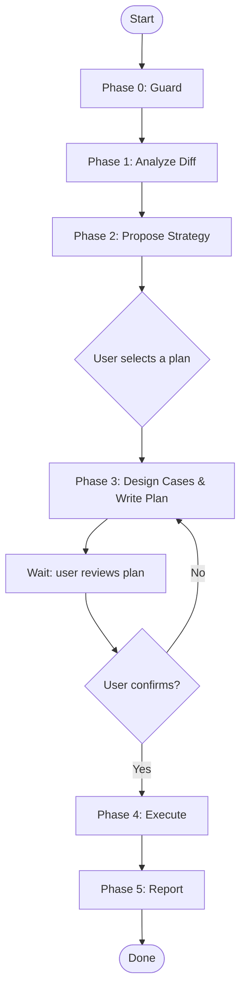

# MagicDoor Test From Diff — Skill Design Spec

## 定位

读取当前分支与 origin/master 的 diff，自动设计 API 测试方案、写测试计划、
执行用例、输出完整报告。全程以用户选择驱动，agent 主动引导而非预设分叉。

## 与 magicdoor-backend-use 的关键区别

| 维度 | backend-use | test-from-diff |
|------|-------------|----------------|
| 起点 | 用户描述 endpoint | agent 读 git diff 自己发现 |
| 策略 | 预设模板 | agent 分析后给 2-3 个选项，用户选 |
| 数据准备 | 靠现有数据 | 从 diff 推断所需数据，自动准备 |
| 用户角色 | 确认 endpoint | 选择策略 + 审阅 test plan |
| env | 用户指定 | 固定 dev |
| 分支检查 | 无 | 必须比 origin/master 新 |

## 核心流程



### Phase 0 — Guard

**固定环境为 dev。** 不做环境选择，不提其他选项。

**分支检查：**

```bash
# fetch 确保 origin/master 最新
git fetch origin master

# 检查当前分支是否有新 commits（跟 origin/master 比）
diff_range="origin/master...HEAD"
commit_count=$(git rev-list --count "$diff_range" 2>/dev/null)

if [ "$commit_count" -eq 0 ] || [ -z "$commit_count" ]; then
  # 停止：当前分支不比 origin/master 新
  echo "当前分支 $(git branch --show-current) 相比 origin/master 没有新的 commits。"
  echo "请确保在功能分支上运行此 skill。"
  exit 1
fi
```

不支持的场景：
- 当前分支就是 `master` → 停止
- 比 `origin/master` 没有增量 commits → 停止

**输出给用户：**

```
当前分支: feat/onboarding-presence-filters
目标 base: origin/master
增量 commits: 1 个

开始分析变更...
```

### Phase 1 — Analyze Diff

```bash
git diff "$diff_range" --stat
git diff "$diff_range"
```

分析内容：
- 哪些文件被修改（统计概览）
- 新增/删除的代码行
- spec/API 契约层面的变化
- 数据库/实体层面的变化

**向用户做简要报告：**

```
## 变更摘要

涉及 10 个文件，覆盖以下层级：
  - Repo (EfRepository): 新增 hasPhoneNumber/hasEmail/hasCompanyName 过滤逻辑
  - Entity (CompanyOnboardingFilter): 新增三个 bool? 字段
  - DTO (CompanyOnboardingFilterDto): 新增三个 bool? 字段
  - Mapping: DTO → Filter 映射
  - Client: MagicCompanyOnboardingClient 新增 query param 传递
  - Tests: FakeClient 过滤 + unit test
  
无数据库 schema 变更（纯查询逻辑）。
```

**注意：agent 不要在此阶段做类型判断（"这是参数变更"）。只陈述变更事实，不加分类标签。**

### Phase 2 — Propose Strategy

根据 Phase 1 的 diff 分析结果，agent 自主设计 2-3 套测试方案。

**参考框架（不强制，但 agent 应以此设计）：**

| 维度 | 说明 |
|------|------|
| **最小覆盖** | 只测 diff 直接涉及的部分，改动最少，风险最低 |
| **边界覆盖** | 在最小覆盖基础上加入边界值和空/异常输入 |
| **关联覆盖** | 延伸到可能受此变更影响的相关路径或组合参数 |

**输出格式：**

```
变更摘要：
  新增 hasPhoneNumber/hasEmail/hasCompanyName 三个 boolean 过滤参数。

基于上述变更，推荐以下测试方案：

方案 A：只测新增参数（最小覆盖）
  验证三个参数的正反场景，不回溯现有参数
  ≈ 7 个用例，预计 2 分钟

方案 B：边界覆盖 ✅ 推荐
  新增参数正反场景 + 组合过滤 + 空值/全 null 边界
  ≈ 9 个用例，预计 3 分钟

方案 C：关联覆盖
  新增参数 × 现有 search/statuses 参数组合
  ≈ 14 个用例，预计 5 分钟

请选择方案（A / B / C），或说明你的想法：
```

要点：
- 方案字母固定格式：`方案 A`、`方案 B`、`方案 C`
- agent 必须标注推荐方案（✅）
- 每个方案包含标题、一句话说明、估算用例数、估算时间
- 如果用户回复模糊但明显指向某个方案，agent 追问确认

### Phase 3 — Design Cases & Write Plan

用户选定方案后，agent 细化具体用例并写 plan 文件。

**设计用例的原则：**

- 每个 case 包含：编号、名称、HTTP 方法和 path、参数、期望结果
- 第一个 case 始终是 Baseline（不带新增参数，验证基础可达性）
- 参数变更为 boolean 类型的，正反场景各一条
- 组合场景 2-3 个即可，不需要穷举

**Plan 文件格式：**

```markdown
---
env: dev
service: subscriptions
goal: PR538 onboarding presence filter
ref: origin/master...feat/onboarding-presence-filters
selected: B  # 用户选择的方案
---

## 变更摘要
新增三个 boolean 过滤参数: hasPhoneNumber, hasEmail, hasCompanyName

## Prep
MagicDoor: userId=1480743304903122944

## Case 1 — Baseline
GET /internal/onboardings?pageSize=20
Expect: 200

## Case 2 — hasPhoneNumber=true
GET /internal/onboardings?hasPhoneNumber=true&pageSize=20
Expect: 200, only records with phone

## Case 3 — hasPhoneNumber=false
GET /internal/onboardings?hasPhoneNumber=false&pageSize=20
Expect: 200, only records without phone
```

**文件路径：** `<project-base>/test-plans/YYYYMMDD-HHmm-<slug>.md`

其中 `<project-base>` 由 agent 根据项目约定自动推断。写 plan 文件前自动创建目录。

**写完后必须输出并等待用户确认：**

```
测试计划已写入: <路径>/test-plans/20260605-1203-PR538-filters.md

请 review 该计划，回复 "确认" 我将开始执行。
```

注意：在收到 "确认" 之前，**不得进入 Phase 4**。用户可能会调整用例，必须以最新版本为准。

### Phase 4 — Execute

**前置步骤：**

1. **生成 token**
   - 从 plan 的 frontmatter 读取 `env`
   - 使用硬编码的 MagicDoor 账户（dev: `1480743304903122944`）
   - 生成并验证 debug token

2. **解析 service base URL**
   - 使用 `@magicdoor/env` CLI 从 dev 环境解析

3. **检查必要的数据**
   - 如果 Plan 中标记了 `prep_seed: true`，执行数据准备脚本

**逐条执行：**

```
Case 1: Baseline → 200 ✅ (11 items)
Case 2: hasPhoneNumber=true → 200 ✅ (8 items)
Case 3: hasPhoneNumber=false → 200 ✅ (3 items)
...
```

- 全自动执行，不需要用户逐个确认
- 每执行一条，直接打印结论（不输出 raw curl 响应）
- token 生命周期检查：执行前检查 token 年龄，若 > 50 分钟则重新生成

**异常处理：**
- 401/403：先检查 token 的 `user_type` 是否匹配 endpoint 要求
- 非 200 状态码：记录实际状态码和错误信息，继续执行下一条

### Phase 5 — Report

执行完所有用例后，输出完整报告。

**模板：**

```
## 测试报告

变更: <变更摘要>
方案: <用户选择的方案>（A/B/C）
身份: <用户名> (MagicDoor)
环境: dev
Plan: <plan 文件路径>

| # | Case | 参数 | 状态 | 结果 |
|---|------|------|------|------|
| 1 | Baseline | - | 200 ✅ | 11 items |
| 2 | hasPhoneNumber=true | hasPhoneNumber=true | 200 ✅ | 8 items |
| 3 | hasPhoneNumber=false | hasPhoneNumber=false | 200 ✅ | 3 items |
| ... | ... | ... | ... | ... |

## 发现
1. 三个新参数功能正常，AND 语义正确
2. phone 字段判断基于 `!string.IsNullOrWhiteSpace()`
3. 组合过滤行为符合预期

## 异常
（如果有失败的用例，在此列出）
```

## Common Mistakes

- **跟 origin/master 的比较范围：** 必须用 `origin/master...HEAD`（三点差集），不是 `--stat` 比较，也不是 `HEAD~1`。
- **没等用户 review plan 就执行：** Phase 3 写完后必须停住，等用户确认才能进入 Phase 4。无例外。
- **token 过期：** 用例多时（5+），在 Phase 4 开始时检查 token 年龄。60 分钟过期，超过 50 分钟就提前重生成。
- **不展示变更摘要直接提案：** Phase 1 必须向用户报告 diff 内容，否则用户无法判断方案是否合理。
- **多 service 同时变更：** 如果 diff 涉及多个后端服务，应当分别按 service 生成独立的 plan 和执行。不要混在一个 plan 里。

## Red Flags

- 当前分支不比 `origin/master` 新 → 停止并说明
- 用户选方案时说"好的"、"都行"等模糊回答 → 追问"你选哪个方案（A/B/C）？"
- 用户 review plan 时说"先测这个"、"先跑这两个" → 说明不能部分执行，询问是否调整 plan
- diff 涉及数据库 schema 变更（如新增字段、改类型）→ 自动识别并在 plan 中标注 `prep_seed: true`
- 用户提供的 userId 的 `user_type` 不匹配 endpoint 要求 → 停止，解释
- 服务返回 500 → 记录响应体，继续后续用例，在报告中突出标记
- 多 service 变更但 agent 没识别到 → 在 Phase 1 分析时逐个文件检查路径前缀
