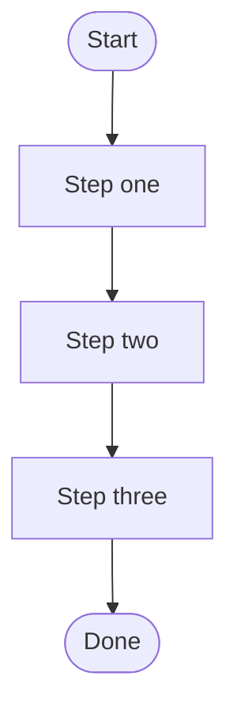

## Overview

One sentence explaining the skill's purpose and output.

## Core Flow

You MUST create a task for each item and complete them in order.

<!-- NOTE: Step names in the flowchart MUST match the section titles below exactly. -->

## Quick Reference

<!-- LMB definition line: only needed for git-workflow-related skills -->
<!-- **LMB** (Latest Main Branch) — remote HEAD branch ref. Detect: `git remote show origin | grep "HEAD branch" | awk '{print $NF}'`. **Always fetch before computing.** -->

### Step one

<!-- If referencing a sub-skill: -->
<!-- **REQUIRED SUB-SKILL:** `sub-skill-name`. Description of what it does and why. -->

Description of what this step does. Include commands, conventions, and expected output.

### Step two

Description. Each step should be self-contained enough that someone can understand it without reading other steps.

### Step three

(Only as many steps as needed. Prefer 2-4.)

## Common Mistakes

- What people get wrong about this skill.
- Another common pitfall.

## Red Flags

- Behavior that should never happen.
- Another warning sign.
