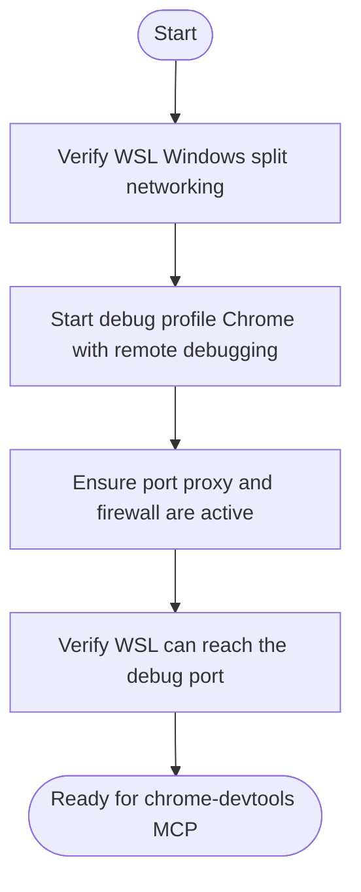

# Windows Chrome Debug Profile Setup

## Overview

When running OpenCode inside WSL2, Chrome DevTools MCP servers cannot launch a usable Windows Chrome instance directly. This skill configures a **dedicated, isolated Chrome profile** on the Windows host, exposes its debugging port across the WSL/Windows boundary, and verifies that WSL can reach it.

**You MUST run this setup before invoking any chrome-devtools MCP tools.**

## When to Use

- You want to debug, screenshot, or audit web pages using Chrome DevTools MCP from WSL.
- You want the debug Chrome session isolated from your personal Chrome profile.
- You are on a WSL2 + Windows host with `networkingMode=bridged` or similar split networking.

## Core Flow

You MUST create a task for each item and complete them in order.



## Quick Reference

### Verify WSL Windows split networking

Run from WSL:

```bash
uname -a
cat /etc/resolv.conf
```

If you use `networkingMode=bridged`, the Windows host has its own IP on the WSL bridge. Find it from Windows:

```powershell
Get-NetIPAddress -AddressFamily IPv4 | Select-Object IPAddress, InterfaceAlias
```

Note the host IP bound to the WSL bridge (e.g. `192.168.3.110`).

### Start debug profile Chrome with remote debugging

On Windows, run in PowerShell or a shortcut. You do **not** need to close your personal Chrome.

```powershell
& "C:\Program Files\Google\Chrome\Application\chrome.exe" `
  --user-data-dir=C:\temp\chrome-debug-profile `
  --remote-debugging-port=9222 `
  --no-first-run `
  --no-default-browser-check
```

**Why a separate profile?** Chrome locks a user-data-dir while running. A dedicated profile avoids conflicts with your personal browsing session and keeps cookies, extensions, and logins isolated from MCP access.

**Why `--remote-debugging-port` only listens on `127.0.0.1`?** Since Chromium M113/M114, `--remote-debugging-address=0.0.0.0` is ignored for security. We use a Windows-side port proxy instead.

### Ensure port proxy and firewall are active

These require administrator elevation. From WSL, trigger UAC:

```powershell
Start-Process powershell -Verb RunAs -ArgumentList '-Command', 'netsh interface portproxy add v4tov4 listenaddress=192.168.3.110 listenport=9222 connectaddress=127.0.0.1 connectport=9222'
```

Then add the inbound firewall rule:

```powershell
Start-Process powershell -Verb RunAs -ArgumentList '-Command', "New-NetFirewallRule -DisplayName 'Chrome-Remote-Debug-9222' -Direction Inbound -LocalPort 9222 -Protocol TCP -Action Allow"
```

Confirm:

```powershell
netsh interface portproxy show all
Get-NetFirewallRule -DisplayName 'Chrome-Remote-Debug-9222' | Select-Object DisplayName, Enabled, Direction, Action
```

### Verify WSL can reach the debug port

From WSL:

```bash
curl -s http://192.168.3.110:9222/json/version
```

Expected output: JSON with `Browser`, `Protocol-Version`, and `webSocketDebuggerUrl`.

If it hangs or times out:

1. Confirm Chrome is running and listening on `127.0.0.1:9222`.
2. Confirm the portproxy entry exists.
3. Confirm the firewall rule allows inbound TCP 9222.
4. Confirm you are using the correct Windows host IP.

### OpenCode MCP configuration

Add to `~/.config/opencode/opencode.jsonc`:

```json
{
  "mcp": {
    "chrome-devtools": {
      "type": "local",
      "command": [
        "npx",
        "-y",
        "chrome-devtools-mcp@latest",
        "--browser-url=http://192.168.3.110:9222"
      ]
    }
  }
}
```

Restart OpenCode to load the MCP server.

## Common Mistakes

- Reusing your personal Chrome profile for MCP automation. This risks exposing personal cookies and state, and can conflict with an already-running browser.
- Forgetting to add the Windows firewall rule after creating the port proxy.
- Using `127.0.0.1:9222` from WSL instead of the Windows host bridge IP.
- Expecting `--remote-debugging-address=0.0.0.0` to work; modern Chromium ignores it.

## Red Flags

- `curl http://<windows-ip>:9222/json/version` hangs → port proxy or firewall is missing.
- Chrome refuses to start with `--remote-debugging-port` → a conflicting Chrome process may hold the port; pick a different `--user-data-dir` or a different port.
- MCP tools time out → OpenCode may not have been restarted after MCP config changes, or the debug Chrome process is not running.
