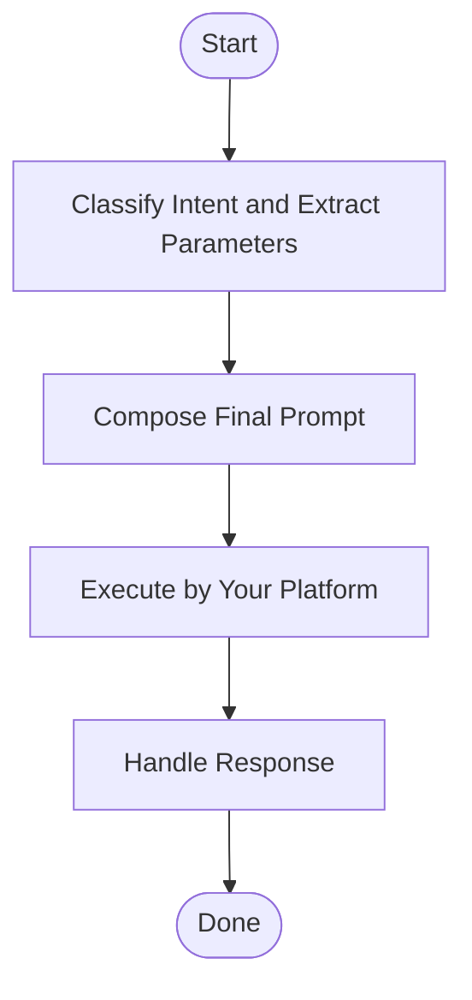

## Overview

Delegate tasks to a companion CLI with session-aware resumption support.

## When to Use

- User asks to resume or continue a previous companion session
- User wants to delegate a long-running task that may span multiple interactions
- User explicitly references an agent by name (`cursor`, `opencode`, `omp`, `codex`) with a specific task
- Task requires session-aware context that outlives a single command

## When NOT to Use

- Simple local commands — one-off file reads, git status, or quick edits
- Tasks completable in the current session — handle immediately without delegation
- User says "run this in terminal" or "execute locally" — implies the current environment
- Exploratory questions — "what is X?" or "how does Y work?" should be answered directly

## Quick Reference

### Classify Intent and Extract Parameters

**Step 1: Classify Mode**
Does the user input contain resumption intent (e.g., `resume`, `continue`, `go back to`)?
- **Yes** → RESUME mode, proceed to Step 2
- **No** → NEW mode, proceed to Step 2

**Step 2: Extract Parameters**

| Parameter | Description | NEW Mode Source | RESUME Mode Source |
|---|---|---|---|
| `$task` | Core task description | Remaining text after parameter extraction | Resumption intent or new directive |
| `$agent` | Target companion CLI | User mention, defaults to `opencode` | Inherit from original session or user override |
| `$files` | Contextually relevant files | Related file paths from context | Related file paths from context |
| `$modelTier` | Model capability level | User-specified or inferred from complexity | Inherit from original session or user override |

**RESUME-specific:**
| Parameter | Source | On No Match |
|---|---|---|
| `$sessionID` | Match history by agent reference, generic reference, or task similarity | Ask whether to start a new task |

**Model Tier Inference:**
| Complexity | Tier |
|---|---|
| Simple questions, trivial edits | `low` |
| Day-to-day features, localized refactors | `medium` |
| Multi-file refactors, architecture changes | `high` |
| Repository-wide changes | `maximum` |

### Compose Final Prompt

**MANDATORY:** Prompt must be composed strictly from the templates below. No structural modifications allowed.

**Step 1: Select Template**

| Mode | Template Structure | Why |
|---|---|---|
| NEW | Task + Context + Rules | Full context and decision rules required |
| RESUME | Task + Changes | Historical context already exists; only delta needed |

**Step 2: Fill Variables**

Replace placeholders only. Do not add, remove, merge, or reorder sections.

| Placeholder | Replacement |
|---|---|
| `{{$task}}` | Core task description |
| `{{$files}}` | Relevant file paths; omit entire Context section for trivial tasks |
| `{{$technical_context}}` | Codebase background and architecture |

**Templates**

NEW mode:
```
## Task
{{$task}}

## Context
{{$technical_context}}
{{$files}}

## Rules
- **Mandatory:** When uncertain about the next step, list the options, mark the best one with ⭐, and end with `[NEEDS_DECISION: <reason>]`.
```

RESUME mode:
```
{{$task}}

{{$files}}
```

### Execute by Your Platform

**Prerequisites**
- `$finalPrompt` composed from template
- All information extracted (Step 2)

**Claude Code**

Use `Monitor` tool to run the companion in background and stream output:

```javascript
Monitor({
  command: `node "$SKILL_ROOT/scripts/companion.mjs" run --agent "${agent}" --model "${modelTier}" <<'__EOF__'
${finalPrompt}
__EOF__`
})
```

**OMP**

Use `bash` with `async: true` to start background job, then `job` to await completion:

```javascript
bash({
  command: `node "skill://runx/scripts/companion.mjs" run --agent "${agent}" --model "${modelTier}" <<'__EOF__'
${finalPrompt}
__EOF__`,
  async: true,
  timeout: 3600
})
// Then: job({ poll: ["bg_<id>"] })
```

For RESUME mode, add `--session "${sessionID}"` before the heredoc in both platforms.

### Handle Response

Companion streams output, then final line: `{"type":"done","success":bool,"summary":{"finalMessage":"...","sessionID":"...","sessionError":"..."}}`

**Response Paths**

| Path | Trigger | Action |
|---|---|---|
| Error | `sessionError` present | Report error and stop |
| Decision | `[NEEDS_DECISION]` in `finalMessage` | [Decision Path Details](#decision-path-details) |
| Default | Neither above | Summarize companion's results |

#### Decision Path Details

When companion returns `[NEEDS_DECISION: ...]`:

1. **Parse** — Extract all options and the ⭐-marked recommendation from `finalMessage`.
2. **Evaluate** — Combine companion's analysis with your existing context. The ⭐ is a strong signal, not an order — use your own judgment.
3. **Decide** — Select the option that best advances the task. Priority: your judgment + ⭐ companion recommendation > task alignment > specificity > first option.
4. **Resume** — Execute RESUME mode via `Execute by Your Platform` with the chosen option, same `$sessionID` and `$modelTier`.

## Core Flow



## Common Mistakes

- Using file contents instead of file paths in `$files`.
- Using a platform-specific tool from the wrong section (e.g. calling `Monitor` on OMP, or calling `job` on Claude Code).
- Not extracting `$sessionID` before resuming — creates a new session instead of continuing.
- Using `read` or `find` to resolve the script path (`skill://runx/scripts/companion.mjs`). `read skill://runx/scripts` returns "File not found" because `skill://<name>/<path>` resolves as a **file** read, not a directory listing. **Correct**: pass `"skill://runx/scripts/companion.mjs"` directly to `bash` — internal URIs auto-resolve to filesystem paths, no manual path lookup needed.
- After companion completes, digging into raw companion log files (`.jsonl`) for the full output. The companion's `finalMessage` in `{"type":"done",...}` already contains the complete result; if truncated in display, look for the `[raw output: artifact://<id>]` footer in the bash result instead.

## Red Flags

- `[NEEDS_DECISION]` without a ⭐-marked option — companion is uncertain, escalate.
- **Asking the user on `[NEEDS_DECISION]`** — violation. See Decision Path Details.
- Multiple `sessionError` in a row — companion may be broken, fall back to direct execution.
- Empty `finalMessage` after a long execution — likely timeout or silent failure.
- **Prompt structure deviates from template** — violation. See Compose Final Prompt.
