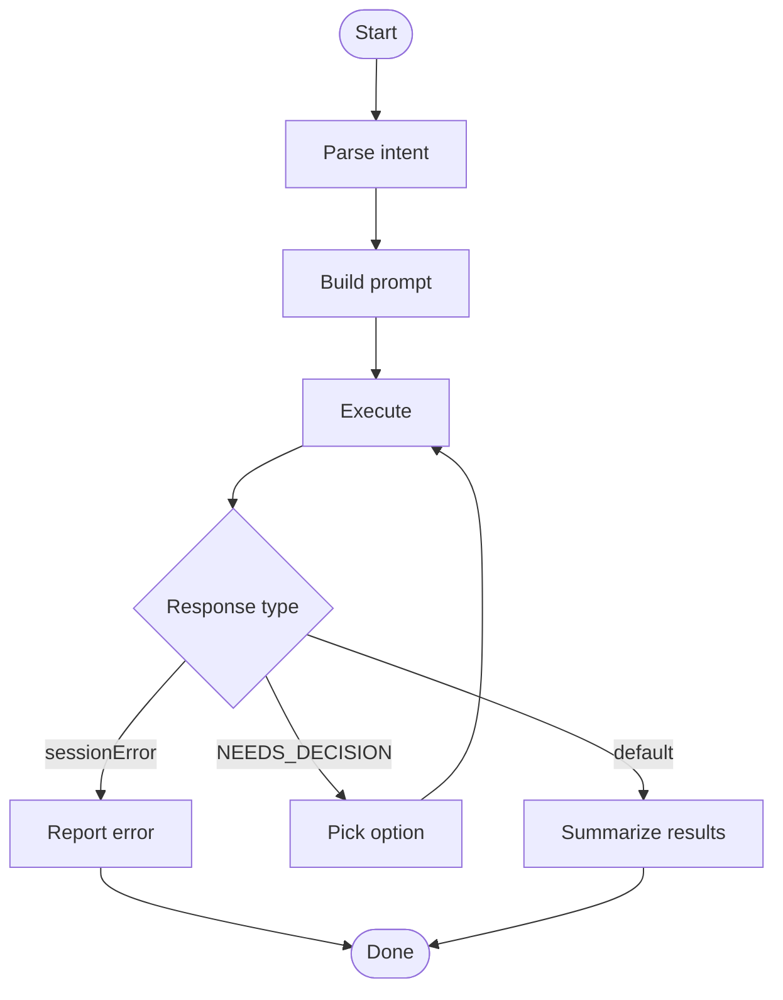

## Overview

Delegate tasks to a companion CLI with session-aware resumption support.

## When to Use

- User asks to resume or continue a previous companion session
- User wants to delegate a long-running task that may span multiple interactions
- User explicitly references an agent by name (`cursor`, `opencode`, `omp`, `codex`) with a specific task
- Task requires session-aware context that outlives a single command

## When NOT to Use

- Simple local commands — one-off file reads, git status, or quick edits
- Tasks completable in the current session — handle immediately without delegation
- User says "run this in terminal" or "execute locally" — implies the current environment
- Exploratory questions — "what is X?" or "how does Y work?" should be answered directly

## Quick Reference

### Parse intent

Parse user intent: classify as `NEW` or `RESUME`, then extract all parameters.

| Parameter | Source | Description |
|---|---|---|
| `$mode` | Intent parse | `NEW` or `RESUME` |
| `$task` | User input | Remaining text after extracting other parameters |
| `$agent` | User input | `cursor`, `opencode`, `omp`, or `codex` (default: `opencode`) |
| `$files` | User input | Explicit file paths only, never contents |
| `$modelTier` | User input or inferred | `low`, `medium`, `high`, `maximum`, `auto` |
| `$sessionID` | Session lookup | Existing session identifier (RESUME only) |
| `$resumeModelTier` | Inferred | Model tier for resumption, based on original session |

**Session lookup (RESUME):** Match against conversation history by agent reference, generic reference, or task similarity. No match → ask to start a new task. Multiple matches → disambiguate via `AskUserQuestion`. User requests agent A, only agent B has history → suggest B or new task.

**Model tier guidelines:**

| Tier | Use When |
|---|---|
| `low` | Simple questions, trivial lookups, tiny edits |
| `medium` | Day-to-day features, localized refactors |
| `high` | Multi-file refactors, architecture changes |
| `maximum` | Repository-wide changes, hardest reasoning |

### Build prompt

Compose `$finalPrompt` strictly from the templates below.

**NEW mode template:**
```
## Task

{{$task}}

## Context

{{Technical background and relevant files. Include $files if any; skip for trivial tasks.}}

## Rules

- **Mandatory:** When uncertain about the next step, list the options, mark the best one with ⭐, and end with `[NEEDS_DECISION: <reason>]`.
```

**RESUME mode template:**
```
{{$task}}

{{Reference file/context changes from $files if present.}}
```

### Execute

Use `Monitor` tool (`persistent: true`), await completion without polling.

**NEW mode command:**
```bash
node "$SKILL_ROOT/scripts/companion.mjs" run --agent "$agent" --model "$modelTier" <<'__EOF__'
$finalPrompt
__EOF__
```

**RESUME mode command:**
```bash
node "$SKILL_ROOT/scripts/companion.mjs" run --agent "$agent" --session "$sessionID" --model "$resumeModelTier" <<'__EOF__'
$finalPrompt
__EOF__
```

### Handle response

The companion streams output, then prints a JSON done marker as the final line:

```json
{
  "type": "done",
  "success": bool,
  "summary": {
    "finalMessage": "...",
    "sessionID": "...",
    "sessionError": "..."
  }
}
```

**Error path:** If `summary.sessionError` is present, report the error to the user and stop.

**Decision path:** If `summary.finalMessage` contains `[NEEDS_DECISION: ...]`, do NOT ask the user. Resume automatically:

1. Extract `$sessionID` from `summary.sessionID`.
2. Use the same `$resumeModelTier`.
3. Pick the best option: companion recommendation (⭐) > task alignment > specificity > first option.
4. Execute the RESUME command via `Monitor`.

Only ask the user when the choice depends on personal preferences you don't know, or all options are equally valid.

**Default path:** Summarize the companion's results for the user.

## Core Flow



## Common Mistakes

- Using file contents instead of file paths in `$files`.
- Polling `Monitor` instead of awaiting completion.
- Asking the user on `[NEEDS_DECISION]` when the criteria clearly picks one option.
- Not extracting `$sessionID` before resuming — creates a new session instead of continuing.

## Red Flags

- `[NEEDS_DECISION]` without a ⭐-marked option — companion is uncertain, escalate.
- Multiple `sessionError` in a row — companion may be broken, fall back to direct execution.
- Empty `finalMessage` after a long execution — likely timeout or silent failure.
