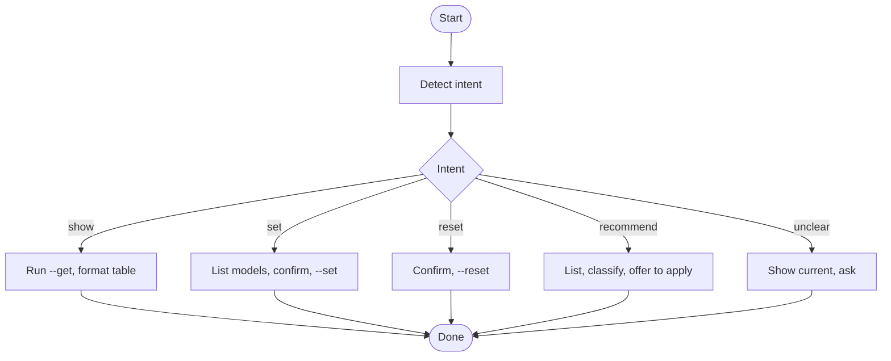

## Overview

/scripts

## When to Use

- User asks to view, set, reset, or get recommendations for companion model tier configuration
- User mentions model names or tiers in context of companion tools

## When NOT to Use

- Configuring non-companion tools
- Running companion tasks (use `runx` skill instead)
- User is asking about model behavior or capability, not configuration

## Quick Reference

### Detect intent

Parse the natural-language prompt and classify into one of these intents:

| Intent | Keywords (examples) |
|---|---|
| `show` | "show", "view", "get", "what", "current", "看", "查看", "当前" |
| `set` | "set", "change", "update", "use", "改成", "设为", "用", "设置" |
| `reset` | "reset", "clear", "unset", "恢复", "重置", "清除" |
| `recommend` | "recommend", "suggest", "what should", "推荐", "建议" |
| `unclear` | No clear match |

### Execute action

/scripts

**show:**
- /scripts
- Format output as a tier-column table (left-align with fixed spacing, `—` for unconfigured tiers).
- If only one adaptor is configured, show that. Both empty → report "No configuration found" and offer to recommend.

**set:**
- Parse which adaptor (`opencode`/`cursor`/`omp`/`codex`) and tier (`low`/`medium`/`high`/`maximum`). Default adaptor: `opencode`.
- If tier missing, show current config and ask.
- /scripts
- /scripts
- Report success or error.

**reset:**
- Determine which adaptor to reset. If unspecified, ask.
- Show current config for that adaptor, ask confirmation.
- /scripts
- Report success or error.

**recommend:**
- /scripts
- Classify available models by capability tier (`low`/`medium`/`high`/`maximum`) based on model ID heuristics.
- Present recommendations alongside current config.
- Ask if user wants to apply. If yes, present proposed config, confirm, execute as in `set`.

**unclear:**
- Show current config via `--get`.
- Ask the user what they'd like to do (show something else, set a tier, reset, recommend).

### Display result

Always show the final state after any write operation by running `--get` again and rendering the table.

## Core Flow

## Safety Rules

- Before `--set`, always confirm with the user unless the exact model was uniquely resolved from `--list` and the user already implicitly confirmed.
- Before `--reset`, always confirm which adaptor and that the user intends to clear.
- If `--list` fails, report the CLI availability issue clearly — do not silently fall back to stale data.
- If `--get` fails, show a clear warning but attempt to continue with partial data.
- Never pass `--model` or `--agent` to `companion.mjs` in the `models` subcommand — only use the flags documented for `models`.

## Common Mistakes

- Calling `--set` without confirming with the user first.
- Silently falling back to stale data when `--list` fails.
- Passing `--model` or `--agent` flags to the `models` subcommand (they are not supported).
- Confusing adaptor names — `codex` has no `--list-models` command, its model config comes from `model-map.json`.
- Not re-running `--get` after a write to confirm the change took effect.

## Red Flags

- `--list` fails for all adaptors — companion CLIs may not be installed or configured.
- User asks to set a model that doesn't appear in `--list` output — warn but allow.
- Multiple resets without verification — configuration drift.
