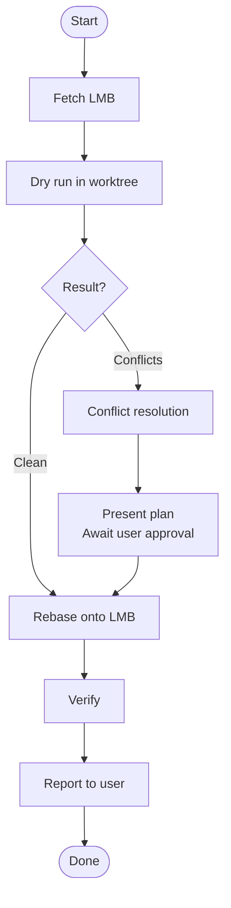

# Keep Branch Fresh

## Overview

Rebase feature branches onto the latest main branch (LMB) safely. **Core principle:**
Always simulate the rebase in an isolated worktree first. Never rebase without a dry-run.

## When to Use

- Feature branch is behind `origin/main` or `origin/master`
- PR shows "out-of-date with base branch" warning
- Need to integrate recent main changes before merging
- Conflicts expected due to overlapping file modifications

## Core Pattern



## Quick Reference

| Step    | Command                                              |
| ------- | ---------------------------------------------------- |
| Dry run | `bash $SKILL_ROOT/scripts/dry-run-conflicts.sh [LMB] [HEAD]` |
| Verify  | `bash $SKILL_ROOT/scripts/verify-no-conflicts.sh`    |

### Conflict Resolution Strategies

| Category                                                           | Strategy                                                                            |
| ------------------------------------------------------------------ | ----------------------------------------------------------------------------------- |
| **Machine-generated** (lockfiles, build artifacts, generated code) | Delete and regenerate. Never hand-edit.                                             |
| **Source & docs**                                                  | Analyze diff chronology and semantics. Prefer LMB features; apply refactors on top. |

## Implementation

### Report Template

```markdown
## Rebase Report

| Item           | Value                         |
| -------------- | ----------------------------- |
| LMB            | `origin/main` (`<short-sha>`) |
| Feature branch | `<branch>` (`<short-sha>`)    |
| Conflicts      | N files                       |

### Resolutions

| File                | Category          | Strategy                                                 |
| ------------------- | ----------------- | -------------------------------------------------------- |
| `package-lock.json` | Machine-generated | Deleted and regenerated                                  |
| `src/App.tsx`       | Source            | Retained LMB hook logic, applied error-handling refactor |

### Commits (top 3)

- `abc1234` — commit message
- `def5678` — commit message
- `ghi9012` — commit message
```

## Common Mistakes

| Mistake                 | Why It Fails                                       | Fix                                         |
| ----------------------- | -------------------------------------------------- | ------------------------------------------- |
| Rebase before dry-run   | Unexpected conflicts waste time and risk data loss | Always dry-run first                        |
| "Conflicts are small"   | Small conflicts hide semantic issues               | Dry-run catches surprises                   |
| "I know the conflicts"  | Overconfidence leads to missed edge cases          | Trust the process, not memory               |
| Hand-editing lockfiles  | Introduces inconsistent dependency states          | Always delete and regenerate                |
| Stale LMB reference     | Rebasing onto outdated main is pointless           | Run `fetch --prune` first                   |
| Using local main branch | Local main may be behind remote                    | Always use `origin/main` or `origin/master` |
| Skipping verification   | Silent merge conflicts or build breaks             | Always run verify script                    |

## Red Flags — STOP and Restart

- Rebase before dry-run → **abort and restart**
- "Conflicts are small" → **dry-run catches surprises**
- "I know them" → **you don't**
- Hand-editing lockfiles → **always regenerate**
- Stale LMB → **run `fetch --prune` first**
- Using local main → **always use remote**
- Skipping verification → **always run verify script**
