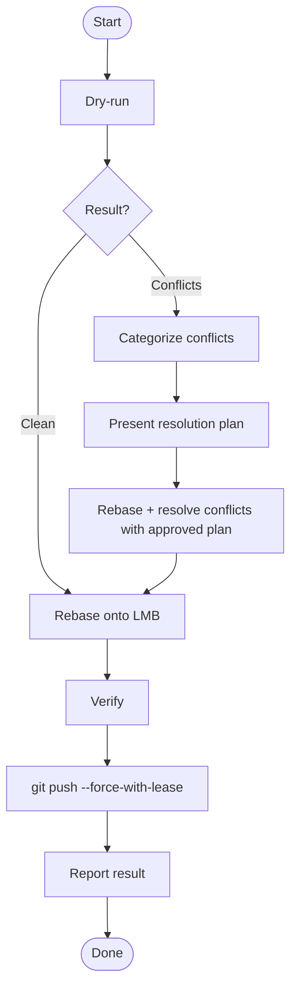

# Keep Branch Fresh

## Overview

Safely rebase a feature branch onto the latest main branch (LMB).

## When to Use

- Feature branch is behind `origin/main` or `origin/master` and needs a fast-forward/rebase
- User asks to rebase, sync, or update a branch to the latest main

## Quick Reference

### Scripts

| Step    | Command                                                                  | Purpose                                                                                                                                                                                              |
| ------- | ------------------------------------------------------------------------ | ---------------------------------------------------------------------------------------------------------------------------------------------------------------------------------------------------- |
| Dry-run | `bash $SKILL_ROOT/scripts/dry-run-conflicts.sh [LMB?] [FEATURE_BRANCH?]` | The dry-run script handles fetching and conflict detection in one step. The actual rebase happens in the working repo only after the dry-run confirms safety or the user approves a resolution plan. |
| Verify  | `bash $SKILL_ROOT/scripts/verify-no-conflicts.sh`                        | Verify that no conflict markers remain and the rebase is in a good state. Exits 0 if clean, exits 1 with details if conflict markers found or rebase is still in progress.                           |

- `LMB` — remote main branch ref (default: `origin/master` → `origin/main`)
- `FEATURE_BRANCH` — branch to rebase (default: current `HEAD`)

### Conflict Categorization Strategies

| Category                                                           | Strategy                                                                            |
| ------------------------------------------------------------------ | ----------------------------------------------------------------------------------- |
| **Machine-generated** (lockfiles, build artifacts, generated code) | Delete and regenerate. Never hand-edit.                                             |
| **Source code & docs**                                             | Analyze diff chronology and semantics. Prefer LMB features; apply refactors on top. |

## Core Pattern

## Common Mistakes

| Mistake                 | Why It Fails                                       | Fix                                         |
| ----------------------- | -------------------------------------------------- | ------------------------------------------- |
| Rebase before dry-run   | Unexpected conflicts waste time and risk data loss | Always dry-run first                        |
| "Conflicts are small"   | Small conflicts hide semantic issues               | Dry-run catches surprises                   |
| "I know the conflicts"  | Overconfidence leads to missed edge cases          | Trust the process, not memory               |
| Hand-editing lockfiles  | Introduces inconsistent dependency states          | Always delete and regenerate                |
| Stale LMB reference     | Rebasing onto outdated main is pointless           | Dry-run script fetches automatically        |
| Using local main branch | Local main may be behind remote                    | Always use `origin/main` or `origin/master` |
| Skipping verification   | Silent merge conflicts or build breaks             | Always run verify script                    |
