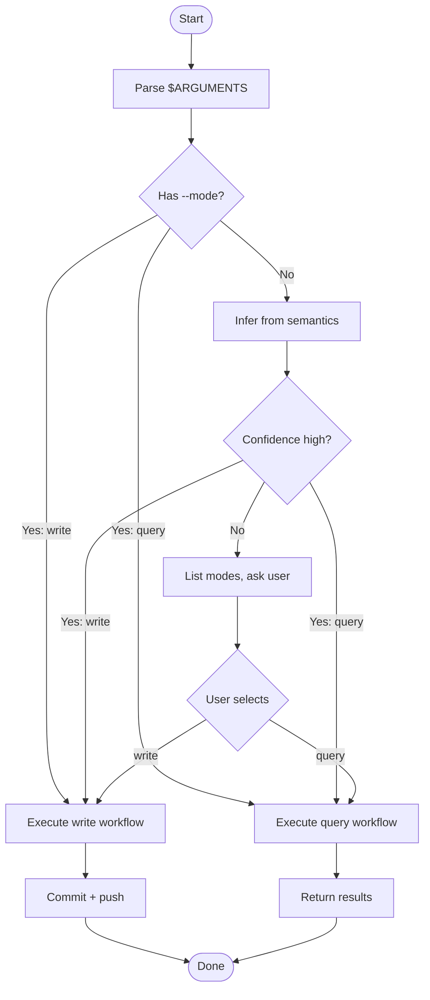

## Overview

Manage the personal knowledge repository at `/root/code/AI-taught-me`. Supports two modes: **Write** (document new case studies, guides, and cheat sheets) and **Query** (search and retrieve existing knowledge). Mode can be set explicitly via `--mode` flag or inferred from natural language.

## When to Use

- User asks to save or document knowledge, tips, or solutions into the AI-taught-me repository
- User asks to query or search previously documented knowledge
- User mentions "AI-taught-me" or wants to interact with the personal knowledge repo

## When NOT to Use

- User is asking general programming questions unrelated to stored knowledge
- User wants to read or edit files outside the AI-taught-me repository
- User wants to modify system configuration or other repos

## Quick Reference

### 1. Parse arguments

`$ARGUMENTS` has two parts: `[--mode <value>] <prompt>`

### 2. Explicit --mode flag (highest priority)

- `--mode write` → **Write Mode**. Execute `./workflows/write.md`. Commit and push after completion (mandatory).
- `--mode query` → **Query Mode**. Execute `./workflows/query.md`. Use `find`/`grep` to locate files — do not read `.md` files directly before searching.

### 3. Semantic inference (fallback)

When no `--mode` is provided, infer from the full prompt. Execute directly — do not ask for confirmation.

- Semantic倾向 "save/record/document" → Write Mode
- Semantic倾向 "search/find/lookup" → Query Mode

### 4. Inference failure

If confidence is low, list modes and let the user choose:

```
Could not determine intent:
1. write  — Record new knowledge to the AI-taught-me repository
2. query  — Search existing knowledge in the AI-taught-me repository

Select (1/2):
```

### 5. Category and topic paths

- Do not guess category/topic paths. Ask the user if uncertain.
- Never create directories deeper than `category/topic/` (2 levels max).

## Core Flow



## Common Mistakes

- Guessing category or topic paths instead of asking the user
- Creating nested directories deeper than `category/topic/` (exceeds the 2-level limit)
- Skipping git commit and push after write mode
- Reading `.md` files directly in query mode before searching with `find`/`grep`
- Forcing a mode guess when inference confidence is low — always list options instead

## Red Flags

- Cannot determine whether user wants write or query mode (confidence too low)
- Category or topic is ambiguous or unknown — ask before proceeding
- Search returns no results, or returns too many matches (>10)
- User request falls outside write/query capability
- Write mode encounters an error before commit — do not lose the drafted content
