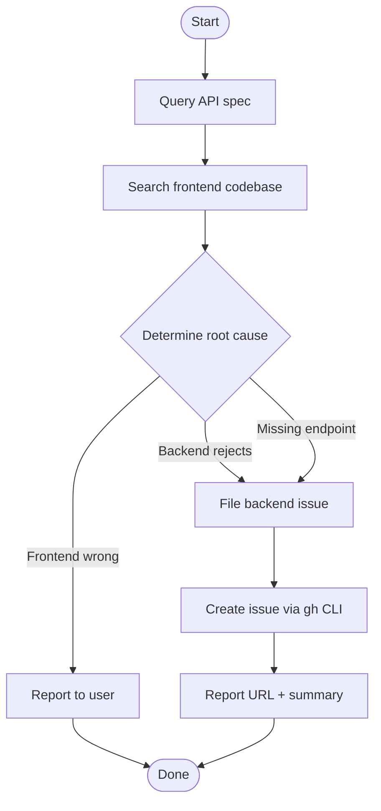

## Overview

When invoked, automatically investigates backend API errors from the conversation context, determines root cause by cross-referencing the API spec and frontend code, and files a structured GitHub issue in the correct backend repository. Returns only the issue URL and a one-line summary.

## When to Use

- User explicitly invokes this skill to file a backend issue
- Clear backend API error exists in the conversation context
- Root cause needs investigation across spec, frontend, and backend behavior

## When NOT to Use

- The issue is clearly a frontend bug (report back to user instead)
- The error is a network or infrastructure issue
- Not enough context about the error response or request payload
- The backend repository is unknown or ambiguous

## Quick Reference

### Step 1 — Query API spec

Use `magicdoor-backend-specs` skill to query the relevant endpoint:

- Expected DTO schema (request body fields, types, constraints)
- Available alternate endpoints (e.g., upload-sessions)
- Compare the actual request against what the spec expects

### Step 2 — Search frontend codebase

Search how the feature uses this API:

- Which fields the frontend sends in different scenarios (create vs edit)
- Any existing patterns for the operation (file addition, removal, etc.)
- Compare frontend usage against spec to identify mismatches

### Step 3 — Determine root cause

| Result | Action |
|---|---|
| Frontend sends wrong field | Report to user, fix frontend |
| Frontend sends correct field but backend rejects | **File backend issue** |
| Missing endpoint for the operation | **File backend issue** (feature gap) |

### Step 4 — File issue in backend repo

Target repo: `MagicDoorInc/backend` (monorepo with `Apps/Portal/` matching stack traces). `MagicDoorInc/portal-backend` is archived — do not use.

Create issue body as a temp file using the template below and submit via `gh`:

```bash
gh issue create \
  --repo MagicDoorInc/backend \
  --title "<Concise bug title>" \
  --label "bug" \
  --body-file /tmp/backend-issue.md
```

Issue body template:

```
## Description

{What happens, when, and why it is wrong.}

## Reproduction Steps

1. {Step 1}
2. {Step 2}
3. {Step 3}

## Error Response

```json
{Full JSON error response body including type, title, status, detail, traceId, exception}
```

## Root Cause

{What the backend code is doing wrong. Reference the use case or class name from stack trace.}

## Suggested Fix Direction

{Concrete recommendation for the backend team. Do not prescribe implementation details.}

## Additional Context

{How the frontend uses this endpoint, cross-reference to spec or frontend PR if applicable.}
```

### Step 5 — Report result

Output only:

```
Filed: https://github.com/MagicDoorInc/backend/issues/{number}
{One-sentence summary of the bug}
```

## Core Flow



## Common Mistakes

- Filing an issue without first querying the API spec via `magicdoor-backend-specs`
- Not searching the frontend codebase before concluding it is a backend bug
- Targeting the archived `MagicDoorInc/portal-backend` repository
- Omitting the full JSON error response and stack trace from the issue body
- Prescribing implementation details instead of suggesting a fix direction
- Adding extra commentary beyond the issue URL and one-line summary

## Red Flags

- `magicdoor-backend-specs` cannot find the relevant endpoint spec
- Error response is incomplete or missing from conversation context
- Frontend codebase search yields no relevant usage patterns
- Unable to determine which backend repository owns the endpoint
- Stack trace points to a use case or handler outside the expected monorepo structure
