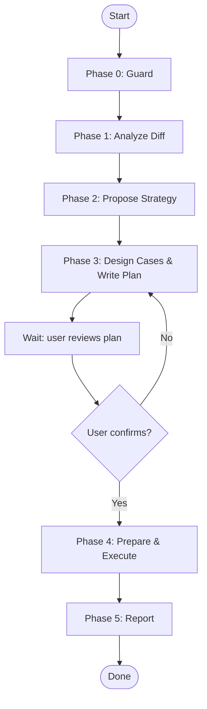

# MagicDoor Test From Diff

## Overview

End-to-end API test workflow driven by git diff analysis. Dispensed on a feature branch, it automatically detects what changed, proposes tailored testing strategies for user selection, writes a test plan for review, then executes and reports results — all without the user pre-describing the endpoint.

测试在**本地环境**执行：使用 Docker PostgreSQL 数据库，本地编译启动服务，通过 `localhost` 进行 API 验证。

## Core Flow

You MUST create a task for each item and complete them in order.



## Quick Reference

### Port & Container

| Item | Value |
|------|-------|
| Local service port | `http://localhost:5595` (from `launchSettings.json` `dev` profile) |
| PostgreSQL container | `magicdoor-pg` (from `.docker/compose.yml`) |
| PostgreSQL port | `localhost:35432` (host mapping) |
| DB name | `<service>` (e.g. `subscriptions`) |
| Auth | Dev token via `https://auth.magicdoor.dev` (local service also validates against dev auth) |

### Service Port Map (from launchSettings)

| Service | Port |
|---------|------|
| Accounting | `http://localhost:5261` |
| Auth | `http://localhost:5168` |
| Education | `http://localhost:5227` |
| Leases | `http://localhost:5133` |
| Payments | `http://localhost:5187` |
| SalesWorkflows | `http://localhost:5031` |
| Subscriptions | `http://localhost:5595` |
| TenantInsurance | `http://localhost:5124` |

### Hardcoded Accounts

| Environment | userId | Name |
|-------------|--------|------|
| dev | `1480743304903122944` | Lei Wang (MagicDoor) |

### Spec Name → Required user_type

| Spec Name | Required user_type |
|-----------|-------------------|
| `Internal` | `MagicDoor` |
| `Debug` | `MagicDoor` |
| `Service2Service` | `System` or `MagicDoor` |
| `CompanyApp` / `CompanyWeb` | `PropertyManager` |
| `TenantApp` | `Tenant` |
| `OwnerApp` | `Owner` |
| `VendorApp` | `Vendor` |
| `Homepage` | No auth |

## Environment

- **测试在本地执行。** 使用 Docker PostgreSQL + `dotnet run` 本地启动服务。
- Auth token 仍通过 `https://auth.magicdoor.dev` 生成（本地服务依赖 dev auth 验证 token）。
- 种子数据通过 `docker exec` 直接插入 PostgreSQL。
- **不依赖 dev/SBX 环境的业务服务。**

### Phase 0 — Guard

**Branch check:**

```bash
git fetch origin master
diff_range="origin/master...HEAD"
commit_count=$(git rev-list --count "$diff_range" 2>/dev/null)
if [ "$commit_count" -eq 0 ] || [ -z "$commit_count" ]; then
  echo "Current branch $(git branch --show-current) has no commits beyond origin/master."
  echo "Run this skill on a feature branch with unmerged changes."
  exit 1
fi
```

**Infrastructure check:**

```bash
# Docker PostgreSQL 必须运行
if ! docker ps --format '{{.Names}}' | grep -q "^magicdoor-pg$"; then
  echo "Local PostgreSQL container (magicdoor-pg) is not running."
  echo "Start it with: cd .docker && docker compose up -d"
  exit 1
fi

# 目标服务端口不能被占用（已有进程在跑则先杀掉）
PORT=$(grep -A5 '"dev"' Apps/<ServiceName>/<ServiceName>.App/Properties/launchSettings.json | grep applicationUrl | grep -oP '\d+' | tail -1)
if lsof -i ":$PORT" >/dev/null 2>&1; then
  echo "Port $PORT is in use. Killing existing process..."
  lsof -ti ":$PORT" | xargs kill -9 2>/dev/null || true
  sleep 2
fi
```

**Stopping conditions:**
- Current branch is `master` itself → stop
- No incremental commits beyond `origin/master` → stop
- Docker PostgreSQL 未运行 → stop
- 数据库不存在 → stop（指导用户创建）

**Output to user:**

```
Current branch: feat/onboarding-presence-filters
Target base: origin/master
Incremental commits: 6

Docker PostgreSQL: ✅
Service port 5595: available

Analyzing changes...
```

### Phase 1 — Analyze Diff

```bash
git diff "$diff_range" --stat
git diff "$diff_range"
```

**Analyze across these dimensions:**
- Files changed (stat overview)
- Lines added/removed
- Spec/API contract changes (routes, params, request/response schemas)
- Entity/model changes
- Repository/data-layer changes
- Test changes

**Do NOT classify the change type.** Just state the facts.

**Report to user:**

```
## Change Summary

10 files changed across:
  - Repository (EfRepository): added hasPhoneNumber/hasEmail/hasCompanyName filter logic
  - Entity (CompanyOnboardingFilter): 3 new bool? fields
  - DTO (CompanyOnboardingFilterDto): 3 new bool? fields
  - Mapping: DTO → Filter mapping
  - Client: query param forwarding
  - Tests: fake client filter + unit tests

No database schema changes (pure query logic).
```

### Phase 2 — Propose Strategy

Based on the diff analysis, design 2-3 testing strategies for the user to choose from.

**Design framework (advisory — use as a checklist):**

| Dimension | Description |
|-----------|-------------|
| **Minimal coverage** | Test only the directly affected surface. Lowest effort, lowest risk. |
| **Boundary coverage** | Add edge values and null/empty input on top of minimal. |
| **Cascade coverage** | Extend to related paths or parameter combinations that may be affected. |

**Output format:**

```
Based on the changes above, here are the recommended test strategies:

Strategy A: Test new params only (minimal coverage)
  Verify true/false for each of the 3 new params, no regression.
  ≈ 7 cases, ~2 min

Strategy B: Boundary coverage ✅ recommended
  True/false per param + combinations + null/empty edge cases.
  ≈ 9 cases, ~3 min

Strategy C: Cascade coverage
  New params × existing params (search, statuses).
  ≈ 14 cases, ~5 min

Which strategy? (A / B / C) Or describe what you have in mind.
```

**Rules:**
- Label strategies as `Strategy A`, `Strategy B`, `Strategy C`
- Mark your recommendation with ✅
- Each strategy must include: title, one-line description, estimated case count, estimated time
- If the user gives a vague answer ("OK", "whatever"), ask "Which strategy do you choose (A/B/C)?"

### Phase 3 — Design Cases & Write Plan

Once the user selects a strategy, expand it into concrete test cases and write a plan file.

**Design principles:**
- Every case includes: number, name, HTTP method + path, parameters, expected result
- Case 1 is always **Baseline** (no new params — verify basic reachability)
- For boolean params: one case per param with `true` and one with `false`
- 2-3 combination cases at most — no exhaustive combinatorial explosion

**Plan file format:**

```markdown
---
env: local
service: subscriptions
goal: PR538 onboarding presence filter
ref: origin/master...feat/onboarding-presence-filters
strategy: B
---

## Change Summary
3 new boolean filters: hasPhoneNumber, hasEmail, hasCompanyName

## Prep
MagicDoor: userId=1480743304903122944
Service: http://localhost:5595

## Seed Data
Golden records for filter testing:
  - ID 100: has phone+email+company, no meeting
  - ID 101: no phone, has email+company, no meeting
  - ID 102: has phone, no email, no company, no meeting
  ...

## Case 1 — Baseline
GET /internal/onboardings?pageSize=20
Expect: 200
```

**Frontmatter fields:**
- `env`: always `local`
- `service`: inferred from the changed paths
- `goal`: short slug
- `ref`: the git diff range used
- `strategy`: the letter the user chose (A/B/C)
- `port`: service port (inferred if not set)
- `prep_seed`: `true` if seed data is needed (always true for local testing)

**Seed data section:** When writing the plan, design golden seed records that cover every combination needed by the test cases. These will be inserted via SQL in Phase 4.

**File path:** Auto-detect the project's ephemeral directory base (e.g. `.ai-workspace/` in MagicDoor backend, `.knowledge/notes/` in agents-for-myself), then write to `<base>/test-plans/YYYYMMDD-HHmm-<slug>.md`. Auto-create directories.

**After writing, you MUST stop and wait for user review:**

```
Test plan written to: <path>/test-plans/20260605-1203-PR538-filters.md

Please review the plan. Reply with "confirm" and I will execute it.
```

**Do NOT proceed to Phase 4 until the user explicitly confirms.** If the user asks for changes, update the plan file and re-present.

### Phase 4 — Prepare & Execute

**Step 1 — Build the solution:**

```bash
dotnet build MagicDoor.<ServiceName>.slnx --verbosity quiet
```

If build fails, fix errors before proceeding. Report build duration.

**Step 2 — Kill existing process on the service port:**

```bash
PORT=<port from launchSettings or plan>
lsof -ti ":$PORT" | xargs kill -9 2>/dev/null || true
sleep 1
```

**Step 3 — Start the service locally (background):**

```bash
dotnet run --project Apps/<ServiceName>/<ServiceName>.App > /tmp/<service>-service.log 2>&1 &
echo "Service PID: $!"
```

**Step 4 — Wait for service to be ready:**

```bash
# Poll until service responds, timeout after 30s
for i in $(seq 1 30); do
  if curl -s -o /dev/null -w "%{http_code}" "http://localhost:$PORT/internal/onboardings?pageSize=1" -H "Authorization: Bearer $TOKEN" 2>/dev/null | grep -q 200; then
    echo "Service ready after ${i}s"
    break
  fi
  sleep 1
done
```

If service fails to start, show the last 10 lines of the log and stop.

**Step 5 — Generate auth token (from dev auth):**

```bash
AUTH_URL="https://auth.magicdoor.dev"
TOKEN=$(curl -s "$AUTH_URL/debug/generate-token?userId=1480743304903122944" | jq -r '.access_token')
```

If 404 or "user not found" → stop and ask for a valid userId.

**Validate token:**

```bash
echo "$TOKEN" | cut -d'.' -f2 | base64 -d 2>/dev/null | jq '{sub, user_type, aud, permissions}'
```

- `user_type` must match endpoint requirement → ❌ mismatch: stop
- `aud` should contain `magicdoor.com` → ⚠️ warn if mismatch
- `permissions` should cover required scope → ⚠️ warn if missing

**Show user:**

```
Token obtained:
- User: Lei Wang (1480743304903122944)
- user_type: MagicDoor ✅
- Permissions: * (all permissions)

Service: http://localhost:5595
```

**Step 6 — Seed data (if plan has `prep_seed: true`):**

Before seeding, check existing data distribution:

```bash
docker exec magicdoor-pg psql -U postgres -d <db_name> -c "
SELECT
  CASE WHEN property_manager_phone IS NOT NULL AND property_manager_phone != '' THEN 'has_phone' ELSE 'no_phone' END AS phone,
  ...
  COUNT(*)
FROM <table>
GROUP BY ... ORDER BY ...;"
```

If the existing data already covers all required combinations, skip seeding. Otherwise, insert golden records:

```bash
docker exec magicdoor-pg psql -U postgres -d <db_name> -c "
INSERT INTO <table> (id, token, created, updated, ...)
SELECT MAX(id) + 1, 'seed-<purpose>-001', NOW(), NOW(), ...
FROM <table>;
"
```

Each seed record should have a **descriptive token** (e.g. `seed-has-phone-no-email-001`) so you can identify it in test results.

**Step 7 — Execute each case:**

```
Case 1: Baseline → 200 ✅ (11 items)
Case 2: hasPhoneNumber=true → 200 ✅ (8 items)
```

- Fully automatic — no per-case confirmation
- Use `curl -s -w "\n%{http_code}" -H "Authorization: Bearer $TOKEN"` to call each case
- Parse JSON response with `jq '.items | length'` for result count
- Print concise conclusions only (status + key finding), never raw curl output
- On 401/403: check token user_type matches endpoint; then continue
- On non-200: log the response, continue to next case
- Verify numerical consistency: for boolean params, true + false should equal baseline

### Phase 5 — Report

After all cases execute, produce the final report.

**Template:**

```
## Test Report

Change: <change summary>
Strategy: <selected strategy> (A/B/C)
Identity: <user name> (MagicDoor)
Environment: local (http://localhost:<port>)
Plan: <plan file path>

| # | Case | Params | Status | Result |
|---|------|--------|--------|--------|
| 1 | Baseline | - | 200 ✅ | 14 items |
| 2 | hasPhoneNumber=true | hasPhoneNumber=true | 200 ✅ | 10 items |
| ... | ... | ... | ... | ... |

## Findings
1. All 3 new params work correctly, AND semantics confirmed
2. Phone field check uses `!string.IsNullOrWhiteSpace()`
3. Combined filter behavior as expected
4. Numerical consistency: true + false = baseline ✅

## Failures
(List any failed cases here with details)
```

## Common Mistakes

- **Diff range:** Always use `origin/master...HEAD` (three-dot symmetric difference), not `HEAD~1` comparison. The diff must reflect what this branch adds over the mainline.
- **Skipping user review of the plan:** Phase 3 must pause. No exceptions.
- **Skipping the change summary:** Phase 1 must report diff content to the user before proposing strategies. Without this, the user can't evaluate the proposals.
- **Forgetting to seed data:** For presence/boolean filter tests, records must exist in both states (true and false). Always check data distribution before executing.
- **Kafka dependency:** Local service will try to connect to Kafka and log warnings. This is normal — filter queries don't depend on Kafka, ignore those warnings.
- **Multiple services in one plan:** If the diff touches more than one backend service, write separate plans and execute them independently.
- **Token expiry is less of a concern locally** (no 50-min limit), but still generate at Phase 4 start and note the expiry.

## Red Flags

- Current branch has no commits beyond `origin/master` → stop.
- Docker PostgreSQL 未运行 → stop, 提示启动 `.docker/compose.yml`
- User gives a vague strategy choice → ask "Which strategy (A/B/C)?".
- User says "just run case 2 first" after plan review → explain partial execution is not supported; offer to adjust the plan.
- Service build fails → stop, fix compilation errors before retrying.
- Service fails to start within 30s → check `/tmp/<service>-service.log` for errors.
- Diff includes DB schema changes (new columns, type changes) → flag in plan frontmatter as `prep_seed: true` and ensure the DB schema is up-to-date (may need `dotnet ef database update`).
- Service returns 500 → log the response body, continue, flag in final report.
- Multi-service diff not caught → during Phase 1, scan all file paths for service prefixes.
