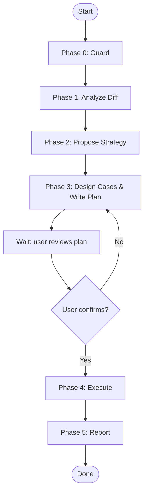

# MagicDoor Test From Diff

## Overview

End-to-end API test workflow driven by git diff analysis. Dispensed on a feature branch, it automatically detects what changed, proposes tailored testing strategies for user selection, writes a test plan for review, then executes and reports results — all without the user pre-describing the endpoint.

## Core Flow

You MUST create a task for each item and complete them in order.



## Quick Reference

### Hardcoded Accounts

| Environment | userId | Name |
|-------------|--------|------|
| dev | `1480743304903122944` | Lei Wang (MagicDoor) |

### Spec Name → Required user_type

| Spec Name | Required user_type |
|-----------|-------------------|
| `Internal` | `MagicDoor` |
| `Debug` | `MagicDoor` |
| `Service2Service` | `System` or `MagicDoor` |
| `CompanyApp` / `CompanyWeb` | `PropertyManager` |
| `TenantApp` | `Tenant` |
| `OwnerApp` | `Owner` |
| `VendorApp` | `Vendor` |
| `Homepage` | No auth |

## Environment

- **Fixed to `dev`.** Business service resolves via `@magicdoor/env -e dev`.
- Auth service: `https://auth.magicdoor.dev`.

### Phase 0 — Guard

**Environment is always `dev`.** Do not ask the user to choose.

**Branch check:**

```bash
git fetch origin master
diff_range="origin/master...HEAD"
commit_count=$(git rev-list --count "$diff_range" 2>/dev/null)
if [ "$commit_count" -eq 0 ] || [ -z "$commit_count" ]; then
  echo "Current branch $(git branch --show-current) has no commits beyond origin/master."
  echo "Run this skill on a feature branch with unmerged changes."
  exit 1
fi
```

**Stopping conditions:**
- Current branch is `master` itself → stop
- No incremental commits beyond `origin/master` → stop

**Output to user:**

```
Current branch: feat/onboarding-presence-filters
Target base: origin/master
Incremental commits: 1

Analyzing changes...
```

### Phase 1 — Analyze Diff

```bash
git diff "$diff_range" --stat
git diff "$diff_range"
```

**Analyze across these dimensions:**
- Files changed (stat overview)
- Lines added/removed
- Spec/API contract changes (routes, params, request/response schemas)
- Entity/model changes
- Repository/data-layer changes
- Test changes

**Do NOT classify the change type.** Just state the facts.

**Report to user:**

```
## Change Summary

10 files changed across:
  - Repository (EfRepository): added hasPhoneNumber/hasEmail/hasCompanyName filter logic
  - Entity (CompanyOnboardingFilter): 3 new bool? fields
  - DTO (CompanyOnboardingFilterDto): 3 new bool? fields
  - Mapping: DTO → Filter mapping
  - Client: query param forwarding
  - Tests: fake client filter + unit tests

No database schema changes (pure query logic).
```

### Phase 2 — Propose Strategy

Based on the diff analysis, design 2-3 testing strategies for the user to choose from.

**Design framework (advisory — use as a checklist):**

| Dimension | Description |
|-----------|-------------|
| **Minimal coverage** | Test only the directly affected surface. Lowest effort, lowest risk. |
| **Boundary coverage** | Add edge values and null/empty input on top of minimal. |
| **Cascade coverage** | Extend to related paths or parameter combinations that may be affected. |

**Output format:**

```
Based on the changes above, here are the recommended test strategies:

Strategy A: Test new params only (minimal coverage)
  Verify true/false for each of the 3 new params, no regression.
  ≈ 7 cases, ~2 min

Strategy B: Boundary coverage ✅ recommended
  True/false per param + combinations + null/empty edge cases.
  ≈ 9 cases, ~3 min

Strategy C: Cascade coverage
  New params × existing params (search, statuses).
  ≈ 14 cases, ~5 min

Which strategy? (A / B / C) Or describe what you have in mind.
```

**Rules:**
- Label strategies as `Strategy A`, `Strategy B`, `Strategy C`
- Mark your recommendation with ✅
- Each strategy must include: title, one-line description, estimated case count, estimated time
- If the user gives a vague answer ("OK", "whatever"), ask "Which strategy do you choose (A/B/C)?"

### Phase 3 — Design Cases & Write Plan

Once the user selects a strategy, expand it into concrete test cases and write a plan file.

**Design principles:**
- Every case includes: number, name, HTTP method + path, parameters, expected result
- Case 1 is always **Baseline** (no new params — verify basic reachability)
- For boolean params: one case per param with `true` and one with `false`
- 2-3 combination cases at most — no exhaustive combinatorial explosion

**Plan file format:**

```markdown
---
env: dev
service: subscriptions
goal: PR538 onboarding presence filter
ref: origin/master...feat/onboarding-presence-filters
strategy: B
---

## Change Summary
3 new boolean filters: hasPhoneNumber, hasEmail, hasCompanyName

## Prep
MagicDoor: userId=1480743304903122944

## Case 1 — Baseline
GET /internal/onboardings?pageSize=20
Expect: 200

## Case 2 — hasPhoneNumber=true
GET /internal/onboardings?hasPhoneNumber=true&pageSize=20
Expect: 200, only records with phone
```

**Frontmatter fields:**
- `env`: always `dev`
- `service`: inferred from the changed paths
- `goal`: short slug
- `ref`: the git diff range used
- `strategy`: the letter the user chose (A/B/C)

**File path:** Auto-detect the project's ephemeral directory base (e.g. `.ai-workspace/` in MagicDoor backend, `.knowledge/notes/` in agents-for-myself), then write to `<base>/test-plans/YYYYMMDD-HHmm-<slug>.md`. Auto-create directories.

**After writing, you MUST stop and wait for user review:**

```
Test plan written to: <path>/test-plans/20260605-1203-PR538-filters.md

Please review the plan. Reply with "confirm" and I will execute it.
```

**Do NOT proceed to Phase 4 until the user explicitly confirms.** If the user asks for changes, update the plan file and re-present.

### Phase 4 — Execute

**Prep (before first case):**

1. **Resolve auth URL:**
   ```bash
   AUTH_URL=$(npm exec -- @magicdoor/env -s auth -e dev -j | jq -r '.url')
   ```

2. **Generate debug token** from the userId in the plan:
   ```bash
   TOKEN=$(curl -s "$AUTH_URL/debug/generate-token?userId=<userId>" | jq -r '.access_token')
   ```
   If 404 or "user not found" → stop and ask for a valid userId.

3. **Validate token:**
   ```bash
   echo "$TOKEN" | cut -d'.' -f2 | base64 -d 2>/dev/null | jq '{sub, user_type, aud, permissions}'
   ```
   - `user_type` must match endpoint requirement → ❌ mismatch: stop
   - `aud` should contain `magicdoor.com` → ⚠️ warn if mismatch
   - `permissions` should cover required scope → ⚠️ warn if missing

4. **Show user:**
   ```
   Token obtained:
   - User: Lei Wang (1480743304903122944)
   - user_type: MagicDoor ✅
   - Permissions: * (all permissions)
   ```

5. **Resolve service base URL:**
   ```bash
   npm exec -- @magicdoor/env -e dev -s subscriptions -j | jq -r '.url'
   ```

6. **Token age check:** Before each case, check if token is > 50 min old. If so, regenerate.

**Execute each case:**

```
Case 1: Baseline → 200 ✅ (11 items)
Case 2: hasPhoneNumber=true → 200 ✅ (8 items)
```

- Fully automatic — no per-case confirmation
- Print concise conclusions only (status + key finding), never raw curl output
- On 401/403: check token user_type matches endpoint; then continue
- On non-200: log the response, continue to next case
- If plan has `prep_seed: true` in frontmatter: prepare seed data before execution

### Phase 5 — Report

After all cases execute, produce the final report.

**Template:**

```
## Test Report

Change: <change summary>
Strategy: <selected strategy> (A/B/C)
Identity: <user name> (MagicDoor)
Environment: dev
Plan: <plan file path>

| # | Case | Params | Status | Result |
|---|------|--------|--------|--------|
| 1 | Baseline | - | 200 ✅ | 11 items |
| 2 | hasPhoneNumber=true | hasPhoneNumber=true | 200 ✅ | 8 items |
| ... | ... | ... | ... | ... |

## Findings
1. All 3 new params work correctly, AND semantics confirmed
2. Phone field check uses `!string.IsNullOrWhiteSpace()`
3. Combined filter behavior as expected

## Failures
(List any failed cases here with details)
```

## Common Mistakes

- **Diff range:** Always use `origin/master...HEAD` (three-dot symmetric difference), not `HEAD~1` comparison. The diff must reflect what this branch adds over the mainline.
- **Skipping user review of the plan:** Phase 3 must pause. No exceptions.
- **Token expiry:** For 5+ cases, check token age at Phase 4 start. Regenerate at 50 min (tokens expire at 60 min).
- **Skipping the change summary:** Phase 1 must report diff content to the user before proposing strategies. Without this, the user can't evaluate the proposals.
- **Multiple services in one plan:** If the diff touches more than one backend service, write separate plans and execute them independently.

## Red Flags

- Current branch has no commits beyond `origin/master` → stop.
- User gives a vague strategy choice → ask "Which strategy (A/B/C)?".
- User says "just run case 2 first" after plan review → explain partial execution is not supported; offer to adjust the plan.
- Diff includes DB schema changes (new columns, type changes) → flag in plan frontmatter as `prep_seed: true` and prepare seed data during execution.
- Service returns 500 → log the response body, continue, flag in final report.
- Multi-service diff not caught → during Phase 1, scan all file paths for service prefixes.
