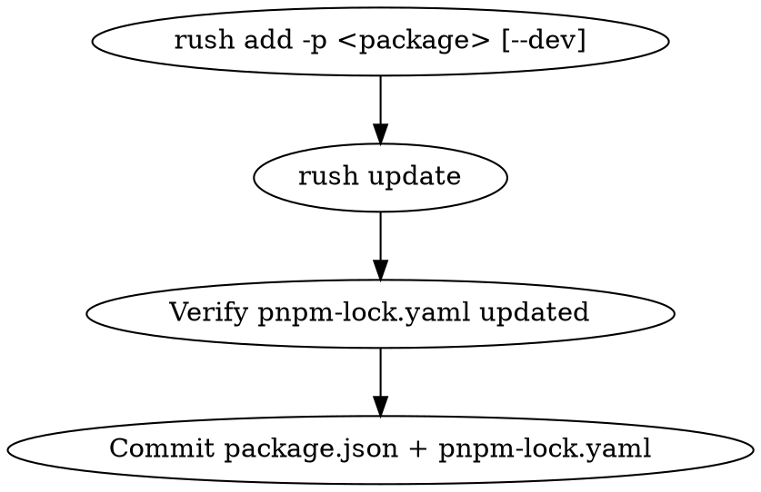
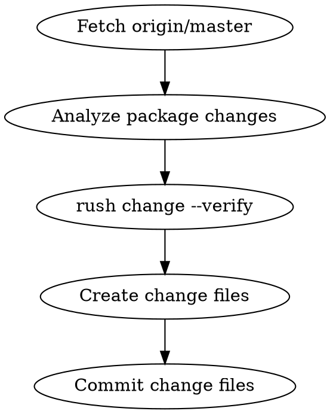

# Rush Monorepo Workflow

## Overview

Complete workflow guide for Rush monorepo operations. Rush is a scalable monorepo manager that uses pnpm for package management and provides tools for change tracking, versioning, and publishing.

**Key Principle**: Always use Rush commands instead of npm/pnpm/yarn directly to maintain monorepo consistency.

## When to Use

- Adding or updating dependencies (`rush add`, `rush update`)
- Generating change files for versioning (`rush change`)
- Building and testing (`rush rebuild`, `rush test`)
- PR validation and pre-commit checks
- Before publishing packages (`rush publish`)

## Critical Rules

### 1. Never Use npm/pnpm/yarn Directly

| ❌ Wrong            | ✅ Correct          |
| ------------------- | ------------------- |
| `npm install`       | `rush update`       |
| `npm install <pkg>` | `rush add -p <pkg>` |
| `npm run build`     | `rush rebuild`      |
| `npm test`          | `rush test`         |

**Why**: Direct npm/pnpm commands bypass Rush's centralized management, causing lockfile mismatches and phantom dependency issues.

### 2. Dependency Changes Require Lockfile Update

**CRITICAL**: After modifying `package.json` (adding/removing dependencies), you **MUST** run `rush update` to update `pnpm-lock.yaml`.

```bash
# After changing package.json dependencies
rush update

# Verify lockfile was updated
git status  # Should show pnpm-lock.yaml changes
```

## Core Workflows

### Workflow 1: Add Dependencies



**Steps**:

1. **Add production dependency**:

   ```bash
   cd packages/<package-name>
   rush add -p <package-name>
   ```

2. **Add dev dependency**:

   ```bash
   cd packages/<package-name>
   rush add -p <package-name> --dev
   ```

3. **Add multiple dependencies**:

   ```bash
   cd packages/<package-name>
   rush add -p <pkg1> -p <pkg2> --dev
   ```

4. **Verify lockfile updated**:

   ```bash
   git status
   # Should show: common/config/rush/pnpm-lock.yaml
   ```

5. **Commit both files**:
   ```bash
   git add package.json
   git add common/config/rush/pnpm-lock.yaml
   git commit -m "chore: add <package> dependency"
   ```

### Workflow 2: Update Dependencies

```bash
# Update all dependencies to latest compatible versions
rush update --full

# Update only changed package.json files
rush update
```

### Workflow 3: Generate Change Files



**Steps**:

1. **Fetch latest**:

   ```bash
   git fetch origin master
   ```

2. **Check existing change files**:

   ```bash
   find common/changes -name "*.json" | sort
   ```

3. **Verify changes**:

   ```bash
   git diff --stat origin/master...HEAD
   ```

4. **Generate change file** (interactive):

   ```bash
   rush change
   ```

   Or create manually following the template below.

5. **Verify change files**:
   ```bash
   rush change --verify
   ```

**Change File Template**:

```json
{
  "changes": [
    {
      "comment": "feat: add reactive initialValues support via Accessor functions",
      "type": "minor",
      "packageName": "@scope/package"
    }
  ],
  "packageName": "@scope/package",
  "email": "user@example.com"
}
```

**File naming**: `common/changes/@<scope>/<package>/{type}-{summary}_{date}.json`

**Change Types**:

| Type    | Use When          | Example                      |
| ------- | ----------------- | ---------------------------- |
| `major` | Breaking changes  | API removal, behavior change |
| `minor` | New features      | New methods, properties      |
| `patch` | Bug fixes, chores | Fixes, docs, tests, deps     |

### Workflow 4: PR Validation

**Required checks before creating PR**:

```bash
# 1. Verify change files exist
rush change --verify

# 2. Install dependencies (catches lockfile issues)
rush install

# 3. Build all packages
rush rebuild --verbose

# 4. Run all tests
rush test
```

### Workflow 5: Manual Change File Creation

When `rush change` interactive mode doesn't work:

```bash
# 1. Get git email
git config user.email

# 2. Analyze changes per package
git diff origin/master...HEAD -- packages/<package>/src/

# 3. Create change file manually
mkdir -p common/changes/@<scope>/<package>
cat > common/changes/@<scope>/<package>/feat-description_$(date +%Y-%m-%d).json << 'EOF'
{
  "changes": [
    {
      "comment": "feat: description of change",
      "type": "minor",
      "packageName": "@scope/package"
    }
  ],
  "packageName": "@scope/package",
  "email": "$(git config user.email)"
}
EOF
```

## Pre-Commit Checklist

Before committing changes in a Rush monorepo:

- [ ] **Dependencies**: If `package.json` changed, run `rush update` and commit `pnpm-lock.yaml`
- [ ] **Change Files**: If source code changed, run `rush change --verify` or create change files
- [ ] **Build**: Run `rush rebuild` to ensure no build errors
- [ ] **Tests**: Run `rush test` to ensure all tests pass

## Common Mistakes

| Mistake                                      | Why It's Wrong                                    | Correct Approach                         |
| -------------------------------------------- | ------------------------------------------------- | ---------------------------------------- |
| `npm install` in package directory           | Bypasses Rush lockfile                            | Use `rush add -p <pkg>`                  |
| `npm install` after manual package.json edit | Creates package-lock.json, ignores pnpm-lock.yaml | Use `rush update`                        |
| Forgetting to commit pnpm-lock.yaml          | CI will fail with lockfile mismatch               | Always commit lockfile changes           |
| Multiple change files for same package       | Confuses versioning                               | Consolidate to one file per package      |
| Change entry without code change             | Inflates version unnecessarily                    | Verify each entry has corresponding diff |
| `rush change` without fetching origin/master | Compares against wrong baseline                   | Always `git fetch origin master` first   |

## Troubleshooting

### Error: "Dependencies of project do not match the current shrinkwrap"

**Cause**: `package.json` was modified but `rush update` wasn't run.

**Fix**:

```bash
rush update
```

### Error: "A phantom node_modules folder was found"

**Cause**: Direct npm/yarn install created conflicting node_modules.

**Fix**:

```bash
rm -rf node_modules  # In project root
rush update
```

### Error: "Cannot find module" after adding dependency

**Cause**: Dependency installed in one package but not available to others.

**Fix**: Ensure dependency is properly declared in package.json and run:

```bash
rush update
rush rebuild
```

## Quick Reference

```bash
# Dependency Management
rush add -p <package>           # Add production dependency
rush add -p <package> --dev     # Add dev dependency
rush update                     # Update lockfile after package.json changes
rush update --full              # Update all dependencies to latest

# Change Management
rush change                     # Interactive change file generation
rush change --verify            # Verify change files are correct
rush change -s                  # Check change status

# Build & Test
rush install                    # Install all dependencies
rush rebuild                    # Clean build all packages
rush rebuild --verbose          # Verbose build output
rush test                       # Run all tests

# Publishing
rush publish                    # Publish changed packages
```

## Best Practices

1. **Always use `rush add`**: Never manually edit `package.json` dependencies without running `rush update`
2. **Commit lockfile**: `pnpm-lock.yaml` must be committed alongside `package.json` changes
3. **One change file per package**: Consolidate multiple changes into single file
4. **Verify before PR**: Run full validation: `rush change --verify && rush install && rush rebuild && rush test`
5. **Conventional commit style**: Use `feat:`, `fix:`, `chore:` prefixes in change file comments
