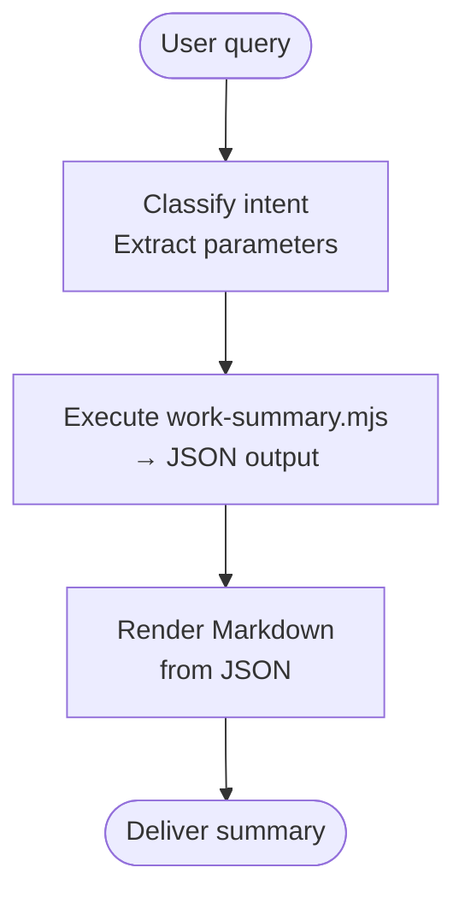

## Overview

Produce a concise, emoji-prefixed, project-grouped Markdown work summary from git history and GitHub PRs for a given date range.

## When to Use

- User asks for a daily, weekly, or custom-range work summary
- User wants current-user filtering, author-date-based counting, project-grouped output, or grouped PR links
- User implies a time range ("today", "this week", "last week", "June 1–5", "last 3 days")

## When NOT to Use

- The project is not tracked by git
- The user only wants raw `git log` output, not a synthesized summary
- The user wants a team-wide summary (this skill filters to a single author by default)

## Quick Reference

### Step 1: Classify Intent and Extract Parameters

| Parameter | Description | Source |
|---|---|---|
| `$timeRange` | Time range intent | Natural language: "today" → today, "this week" → week, "last week" → last-week, custom dates → custom |
| `$startDate` | Start date (YYYY-MM-DD) | Derived from `$timeRange` |
| `$endDate` | End date (YYYY-MM-DD) | Derived from `$timeRange` |
| `$cwd` | Project directory to scan | Default: current directory; optional override via `--cwd` |
| `$author` | Git author email | Default: current user (`git config user.email`); optional override |
| `$prState` | PR state filter | Default: `all`; optional: `open`, `merged`, `closed` |

**Date Range Inference:**

| Trigger | Logic |
|---|---|
| "today", "今日" | start = end = today |
| "this week", "本周", "这周" | most recent Saturday → next Friday |
| "last week", "上周" | previous Saturday → previous Friday |
| "this month", "本月", "这月" | 1st of this month → today |
| Exact range (e.g., "June 1 to 5") | Parse directly |
| "last N days" | N days ago → today |

### Step 2: Execute the Script

The script is located in the same directory as this SKILL.md (symlinked into `~/.claude/skills/work-summary/` by `sync-skills.mjs`):

```bash
script="$(dirname "$0")/work-summary.mjs"
node "$script" --start-date "$startDate" --end-date "$endDate" [--cwd "$cwd"] [--author "$email"] [--pr-state "$prState"]
```

On platforms that expose `SKILL_DIR` or `skill_dir`, prefer those over `dirname "$0"`.

Use `--cwd` to scan a project directory other than the current one:

```bash
node "$script" --start-date "$startDate" --end-date "$endDate" --cwd ~/code/magicdoor
```

### As a data source for other skills

Other skills invoke `work-summary` with these parameters:

| Parameter | Required | Description |
|-----------|----------|-------------|
| `--start-date` | yes | Start date in YYYY-MM-DD |
| `--end-date` | yes | End date in YYYY-MM-DD |
| `--cwd` | no | Project directory to scan. Defaults to current directory. |
| `--author` | no | Author email override |
| `--pr-state` | no | `all` (default), `open`, `merged`, `closed` |

It returns Markdown with two sections:

1. Project summaries (suitable for TASK / NOTES cells)
2. `# PRs` section (suitable for PR LINK cells)

### Step 3: Render the Summary from JSON

The script outputs a single JSON object to stdout. Render it as Markdown:

1. For each project in `projects`:
   - `## {project.name}`
   - Up to 3 bullet points, merging related commit subjects semantically
   - Each bullet: `emoji action + outcome/purpose`
2. If any project has PRs, append `# PRs` section:
   - Group by project: `## {project.name}`
   - List each PR as `- [{state}] #{number}: {title} — {url}`
3. If `warnings` array is non-empty, prepend a `> ⚠️` note with each warning.

**Emoji reference:**
- 🚀 Feature / major addition
- 🛠️ Improvement / refactor
- 🐛 Bug fix
- ✅ Task / chore / cleanup
- 📚 Documentation
- ⚡ Performance

## Core Flow



## Common Mistakes

- Forgetting to filter by author email, showing team commits
- Using committer date instead of author date, causing off-by-one-day errors
- Including squash-merge commits that repackage earlier work in the same range
- Running the script in a non-git directory without scanning subdirectories
- Skipping PR query because `gh` CLI is not authenticated, without warning the user

## Red Flags

- `gh` CLI not logged in → PR section missing; always check `warnings` in JSON
- Empty `projects` array → respond with "No commits found in the specified range"
- Script exits non-zero → show stderr to the user before attempting to parse JSON
- Large monorepo scanning too deep → this skill scans only one level of subdirectories
