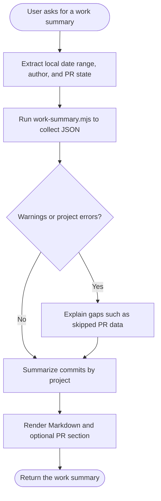

## Overview

Collect commit and pull-request data for a local-date range, then render it into a project-grouped work summary.

## When to Use

- User asks for a daily, weekly, or custom-range work summary.
- User wants the summary limited to one author or grouped by repository.
- User wants related PR links or PR-state filtering alongside commit activity.
- User needs author-date based results instead of committer-date based results.

## When NOT to Use

- User only wants raw `git log` output or a single command explanation.
- The target directory is not a git repo and has no direct child repos to scan.
- The user wants a team-wide report that spans multiple authors instead of one author filter.

## Quick Reference

### Classify Intent and Extract Parameters

| Parameter | Description | Source |
| --- | --- | --- |
| `$startDate` | Inclusive local start date | Infer from phrases like `today`, `this week`, `last week`, `this month`, or explicit dates |
| `$endDate` | Inclusive local end date | Infer from the same phrase or explicit range |
| `$author` | Optional author email override | User-provided email; omit the flag to default to `git config user.email` |
| `$prState` | Optional PR-state filter | Default to `all`; use `open`, `closed`, or `merged` only when the user narrows it |

### Execute the Script

Run `node "$SKILL_DIR/work-summary.mjs" --start-date "$startDate" --end-date "$endDate" [--author "$author"] [--pr-state "$prState"]`.

The script returns JSON with:

- `meta.generatedAt` in local time with a numeric offset
- `meta.timezone` as the local IANA timezone
- `warnings` for skipped PR collection, such as unauthenticated `gh`
- `projects[].commits` filtered by author date and de-duplicated for squash merges
- `projects[].prs` filtered by `mergedAt` in range, or `createdAt` when `mergedAt` is absent

### Render the Result

Turn `projects` into Markdown with one heading per project, merge related commits into no more than three work items per project, write each item as `emoji + action + outcome/purpose`, and append a `# PRs` section only when PR data exists.

## Core Flow

## Common Mistakes

- Passing relative labels like `today` into the script instead of converting them to concrete `YYYY-MM-DD` dates first.
- Forgetting that the script filters commits by author date in code, not with `git log --after/--before`.
- Treating every `(#123)` commit as real work even when it is only a squash-merge wrapper around earlier commits in the same range.
- Assuming PR data is available without checking `warnings` for `gh` authentication failures.

## Red Flags

- Running the script without `--start-date` or `--end-date`.
- Scanning deeper than one directory level when the current directory is not itself a git repo.
- Rendering raw commit subjects directly to the user instead of rewriting them into outcome-oriented summary items.
- Ignoring project-level `errors` or top-level `warnings` and claiming the report is complete.
