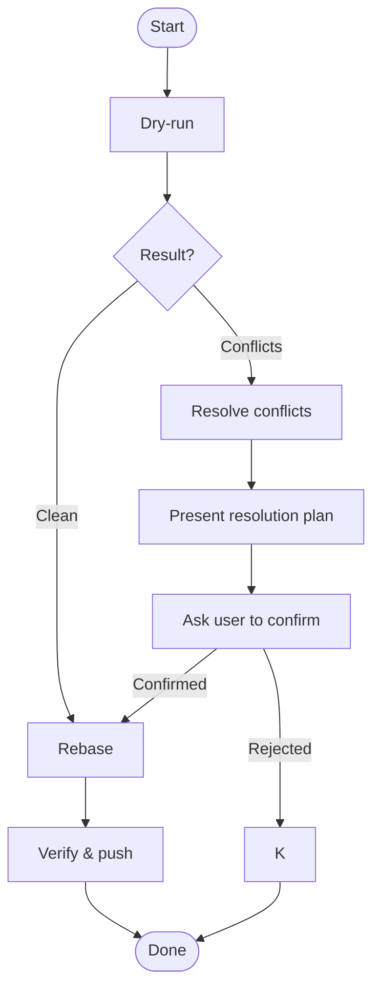

## Overview

Safely rebase a feature branch onto the latest main branch (LMB).

## Quick Reference

**LMB** (Latest Main Branch) — remote HEAD branch ref. Detect: `git remote show origin | grep "HEAD branch" | awk '{print $NF}'`. **Always fetch before computing.**

**FEATURE_BRANCH** — branch to rebase (default: current `HEAD`)

### Dry-run

`skill://keep-branch-fresh/scripts/dry-run-conflicts.mjs [LMB] [FEATURE_BRANCH]`

Fetches latest LMB and detects conflicts in one step. The actual rebase only proceeds after dry-run confirms safety or the user approves a resolution plan.

- Clean → proceed to rebase.
- Conflicts found → categorize and present resolution plan (see [Resolve conflicts](#resolve-conflicts)).

### Resolve conflicts

Only needed when dry-run detects conflicts.

| Category                                                           | Strategy                                                                                                                                                                                 |
| ------------------------------------------------------------------ | ---------------------------------------------------------------------------------------------------------------------------------------------------------------------------------------- |
| **Machine-generated** (lockfiles, build artifacts, generated code) | Delete and regenerate. Never hand-edit.                                                                                                                                                  |
| **Source code & docs**                                             | Preserve each feature commit's intent by transplanting onto LMB's refactored structure. Read the commit message to determine intent. Defer to user only when preservation is infeasible. |

Present plan to user, get confirmation, then proceed to rebase.

### Rebase

Execute the rebase onto LMB. Each commit's intent is preserved.

If `git rebase --continue` opens an editor and hangs in non-interactive terminal: `GIT_EDITOR=true git rebase --continue` or `git rebase --continue --no-edit`.

### Verify & push

`skill://keep-branch-fresh/scripts/verify-no-conflicts.mjs`

Exits 0 if clean, exits 1 with details if conflict markers remain or rebase is still in progress.

Then `git push --force-with-lease`.

## Core Flow

## Common Mistakes

- Rebasing before dry-run — unexpected conflicts waste time and risk data loss.
- Assuming "conflicts are small" — small conflicts hide semantic issues.
- Overconfidence about known conflicts — trust the process, not memory.
- Hand-editing lockfiles — introduces inconsistent dependency states. Always delete and regenerate.
- Using stale LMB reference — rebasing onto outdated main is pointless. Dry-run script fetches automatically.
- Using local branch name instead of LMB — local branch may be behind remote. Use `git remote show origin | grep "HEAD branch"` to detect LMB.
- Skipping verification — silent merge conflicts or build breaks.
- `git rebase --continue` hangs in non-interactive terminal — use `GIT_EDITOR=true git rebase --continue`.

## Red Flags

- Rebasing before dry-run.
- Force-pushing without verifying.
- Hand-editing lockfiles.
- Skipping verification after rebase.
