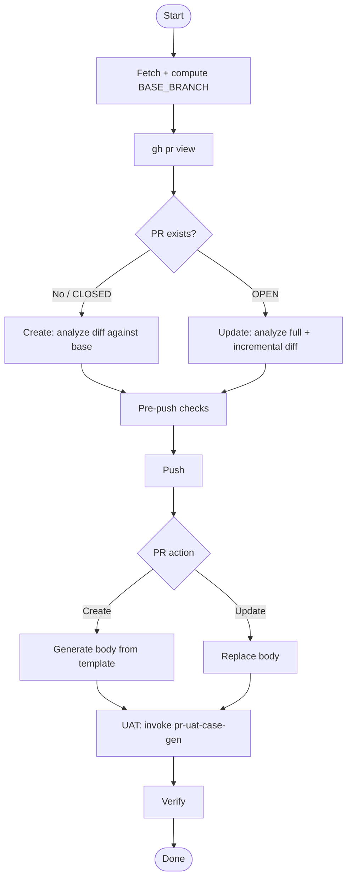

## Overview

Auto-detects create vs update from PR state. Prepares PR body, runs pre-push checks, invokes `pr-uat-case-gen` for frontend repos.

## When to Use

- Feature branch complete, ready for QA review
- Existing PR needs body update with new changes
- Pre-push checks should run before submitting

## When NOT to Use

- Draft PR still in progress
- Changes not ready for review
- Non-feature branches (chore/refactor)

## Quick Reference

| `gh pr view` state | Flow           |
| ------------------ | -------------- |
| No PR / CLOSED     | Create PR Flow |
| OPEN               | Update PR Flow |

### Format

PR body from template, in order:
`.github/pull_request_template.md` → `docs/PR_TEMPLATE.md` → `.github/PULL_REQUEST_TEMPLATE.md`

Append: summary + file changes + where-to-test + edge cases.

### Steps

| Action | Detail |
|---|---|
| Analyze | Create: `git diff origin/$BASE_BRANCH..HEAD`. Update: full + incremental diff since last push. |
| Pre-push | Run [checks](#pre-push-checks). Stop on fail. |
| Push | — |
| Body | Template → base + summary + file changes + where-to-test + edge cases. Create: new PR. Update: replace entirely. |
| UAT | Invoke `pr-uat-case-gen`. If case file generated → post/update single `<!-- uat-cases:... -->` comment. See below. |
| Verify | `gh pr view`. |

### UAT Integration

**REQUIRED SUB-SKILL:** `pr-uat-case-gen`. Frontend repos only.

1. Run `pr-uat-case-gen` → generates `.knowledge/notes/uat-cases.md`.
2. File exists and non-empty:
   - Compute `FEATURE_SLUG=$(git branch --show-current | sed 's/.*\///' | sed 's/[A-Z]/\L&/g; s/_/-/g')`.
   - Search PR for existing `<!-- uat-cases:$FEATURE_SLUG -->` comment.
   - Found → PATCH. Not found → POST (new comment).
3. File empty or missing → skip UAT.

## Pre-push Checks

Probe in order: `rush.json` → `package.json` → `go.mod` → `Cargo.toml` → `pyproject.toml` → `Makefile` → none. Run standard checks per type. `rush.json` → skip all, recommend `rush build`. Failure stops flow.

## Core Flow

## Common Mistakes

- Creating PR before pushing → empty body, broken links.
- Skipping pre-push checks under time pressure.
- Not fetching remote before computing BASE_BRANCH (stale local).
- Using wrong BASE_BRANCH when origin HEAD differs from local main.

## Red Flags

- `git push` before pre-push checks.
- Force-push without checking PR state.
- Rebasing without fetching origin HEAD first.
- Skipping UAT with "backend-only" excuse on repos with `.tsx`/`.jsx`.
