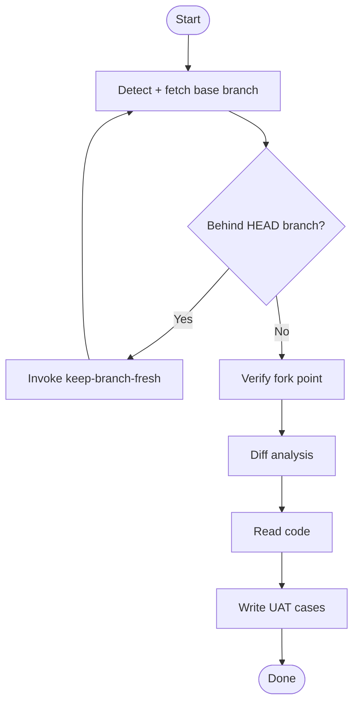

## Overview

Generate UAT test cases for frontend feature branches. Each case traces to actual code changes in the diff. Output: `.knowledge/notes/uat-cases.md`.

## When to Use

- Feature branch ready for QA handoff (frontend repos)

## When NOT to Use

- Backend-only changes
- Non-feature branches (chore/refactor/infra)
- Empty diff
- No user-facing behavior change

## Quick Reference

**REQUIRED SUB-SKILL:** keep-branch-fresh

| Action       | Detail                                                                                                  |
| ------------ | ------------------------------------------------------------------------------------------------------- |
| Detect base  | `git remote show origin \| grep "HEAD branch" \| awk '{print $NF}'` → `$BASE_BRANCH`. **Always fetch**. |
| Check behind | `git merge-base --is-ancestor $BASE_BRANCH HEAD`. Non-zero → invoke `keep-branch-fresh`, recheck.       |
| Verify fork  | `MERGE_BASE=$(git merge-base HEAD $BASE_BRANCH)`. Bad fork → ask user, stop.                            |
| Diff         | `git diff --stat $MERGE_BASE..HEAD`. Confirm scope.                                                     |
| Read         | Understand behavior change, impact, edge cases.                                                         |
| Write        | Up to 10 cases, fewer for small diffs. Each tied to actual code change.                                 |

### Format

```
# UAT Test Cases

_Generated by pr-uat-case-gen skill_

## Case N: [title]
**Priority**: P0/P1/P2 | **Module**: [Area]
**Test Steps** / **Expected Results** / **Risk Point** / **Related Code**
```

## Core Flow



## Common Mistakes

- Stale base → wrong diff. Always fetch + check behind first.
- Few focused cases > many weak ones.
- Unrelated files inflate scope; cases not traceable to code change.
- Missing P0 for medium-to-large diff.
- Implementation-oriented cases instead of user-facing scenarios.

## Red Flags

- Copy-paste cases from previous feature.
- Cases that test behavior not yet implemented.
