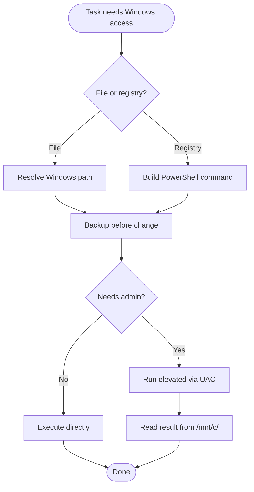

# Windows from WSL

## Overview

Operate Windows-side filesystem, registry, and PowerShell scripts from within WSL, using PowerShell as the single compatibility layer.

## Core Flow



## Quick Reference

### Resolve Windows user path

```bash
# Default: first non-system user profile
USER=$(ls /mnt/c/Users/ | grep -v -E '^(Public|Default|All Users|desktop.ini)$' | head -1)

# Fallback: most recently modified profile
USER=$(ls -td /mnt/c/Users/*/ | head -1 | xargs -n1 basename)
```

Base paths:
- User home: `/mnt/c/Users/$USER/`
- AppData Local: `/mnt/c/Users/$USER/AppData/Local/`
- AppData Roaming: `/mnt/c/Users/$USER/AppData/Roaming/`
- Documents: `/mnt/c/Users/$USER/Documents/`

### File operations

- WSL can read/write `/mnt/c/` directly.
- Always backup before modifying:
  ```bash
  cp file.json file.json.bak.$(date +%s)
  ```
- Use JSON-aware editing for `.json` files.
- Windows files use CRLF; Edit/Read tools handle this transparently.

### PowerShell execution

Use `powershell.exe` for best compatibility. PowerShell Core (`pwsh.exe`) is intentionally not used.

```bash
# Run a command and capture output
powershell.exe -Command "Get-ItemProperty HKCU:\\Software\\Microsoft\\Windows\\CurrentVersion\\Explorer"
```

For multi-line scripts, write a `.ps1` file to `/mnt/c/` and invoke it:
```bash
powershell.exe -ExecutionPolicy Bypass -File C:\\path\\to\\script.ps1
```

### Registry operations

Use the PowerShell registry provider only.

- Read HKCU:
  ```powershell
  Get-ItemProperty HKCU:\Software\Foo -Name Bar
  ```
- Write HKCU:
  ```powershell
  Set-ItemProperty HKCU:\Software\Foo -Name Bar -Value baz
  ```
- Create missing key:
  ```powershell
  New-Item -Path HKCU:\Software\Foo -Force
  ```

### Admin operations requiring UAC

HKLM writes, system-wide changes, and some cmdlets require elevation.

Trigger UAC via `Start-Process -Verb RunAs`:
```powershell
Start-Process powershell.exe -Verb RunAs -ArgumentList "-Command `"Set-ItemProperty HKLM:\...\... -Name X -Value Y; Out-File -FilePath C:\temp\result.txt -InputObject 'done'`""
```

Have the elevated process write results to a file under `/mnt/c/` so WSL can read them back.

## Common Mistakes

- Using `pwsh.exe` instead of `powershell.exe` on systems where only Windows PowerShell is installed.
- Editing registry directly with file tools instead of the PowerShell registry provider.
- Forgetting to backup before modifying Windows config files.
- Running elevated commands and losing the output because it was not written back to `/mnt/c/`.

## Red Flags

- Hardcoding `C:\Users\username` instead of resolving the username dynamically.
- Modifying `HKLM:` without UAC elevation.
- Using `.reg` files instead of PowerShell cmdlets.
- Mixing application-specific config guidance into this skill.
