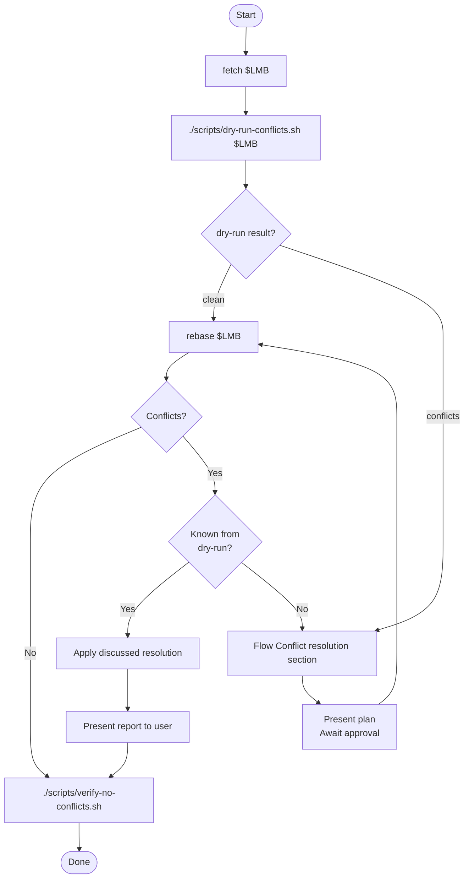

description: Use when rebase onto LMB, e.g. origin/master.
---

# Rebase onto LMB

- **Core principle:** Simulate in an isolated worktree first. LMB = Latest Main Branch (e.g. `origin/master`). Never rebase without dry-run.
- **When to use:** branch diverged from LMB, conflicts expected, overlapping files.

## Rebase flow



## Conflict resolution

| Category                                                           | Strategy                                                                            |
| ------------------------------------------------------------------ | ----------------------------------------------------------------------------------- |
| **Machine-generated** (lockfiles, build artifacts, generated code) | Delete and regenerate. Never hand-edit.                                             |
| **Source & docs**                                                  | Analyze diff chronology and semantics. Prefer LMB features; apply refactors on top. |

## Report template

```markdown
## Rebase Report

| Item           | Value                         |
| -------------- | ----------------------------- |
| LMB            | `origin/main` (`<short-sha>`) |
| Feature branch | `<branch>` (`<short-sha>`)    |
| Conflicts      | N files                       |

### Resolutions

| File                | Category          | Strategy                                                 |
| ------------------- | ----------------- | -------------------------------------------------------- |
| `package-lock.json` | Machine-generated | Deleted and regenerated                                  |
| `src/App.tsx`       | Source            | Retained LMB hook logic, applied error-handling refactor |

### Commits (top 3)

- `abc1234` — commit message
- `def5678` — commit message
- `ghi9012` — commit message
```

## Red flags

- Rebase before dry-run → abort and restart
- "Conflicts are small" → dry-run catches surprises
- "I know them" → you don't
- Hand-editing lockfiles → always regenerate
- Stale LMB → run `fetch --prune` first
- Using local main → always use remote
- Skipping verification → always run verify script
