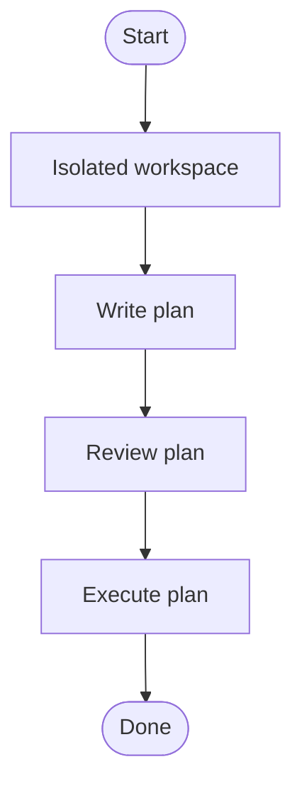

## Overview

Orchestrate the full pipeline from spec to working implementation inside the current session: isolate the workspace, write a plan, review it against the spec, then execute it task by task.

This skill is a thin wrapper around the superpowers skills. It assumes they are already installed and available.

## Core Flow

You MUST create a task for each stage and complete them in order.

## Quick Reference

### Isolated workspace

**REQUIRED SUB-SKILL:** `superpowers:using-git-worktrees`

Run its Step 0 detection first. If already inside a linked worktree, continue there. If not, create one before doing anything else. Never write a plan or code in the main checkout.

### Write plan

**REQUIRED SUB-SKILL:** `superpowers:writing-plans`

Pass the spec as input. Surface assumptions explicitly and ask before guessing. Save the plan to disk. Do not proceed until the plan file exists.

### Review plan

Review the written plan against the original spec. Fix inline if any check fails. All checks must pass:

- Every requirement maps to a task
- No TBD, TODO, or vague steps
- Names and types are consistent across tasks
- Each task is verifiable and self-contained
- Test commands are explicit with expected output
- Later tasks correctly reference earlier outputs
- All file paths are exact and consistent
- No tasks for unrequested features or premature abstractions
- Ambiguities were surfaced and resolved, not silently guessed
- Each task has explicit verification steps

### Execute plan

**REQUIRED SUB-SKILLS:** `superpowers:executing-plans`, `superpowers:requesting-code-review`, `superpowers:finishing-a-development-branch`

Also apply `superpowers:test-driven-development` and `karpathy-guidelines` throughout.

For each task:

1. Mark it `in_progress`.
2. Follow the steps exactly and run the verification command.
3. Commit the task's changes.
4. Run the review gate. Self-review only if **all** of the following are true:
   - Touches ≤ 3 files
   - Net diff ≤ 30 lines
   - No API / signature changes
   - No state, concurrency, permissions, or error-handling changes
   - One clear verification command covers the change
5. If self-reviewing, run this checklist:
   - The diff fully covers the task
   - No changes outside the plan
   - No TBD/TODO comments, hard-coded values, or magic numbers
   - Verification tests behavior, not just existence
   - Obvious edge cases are handled
6. If any gate fails or you are unsure, use `superpowers:requesting-code-review` with a task brief and review package.
7. Mark the task complete only after review passes.

After all tasks:

- Generate a whole-branch review package.
- Dispatch the final reviewer.
- Address any findings.
- Use `superpowers:finishing-a-development-branch` to complete the work.

## Common Mistakes

- Planning or coding in the main checkout instead of an isolated worktree
- Writing code before the plan exists on disk
- Treating mental review as sufficient for Stage 2
- Skipping review because the user seems impatient
- Adding features, abstractions, or "nice-to-haves" not in the spec
- Refactoring or reformatting code the changes did not touch
- Marking a task complete without running its verification step

## Red Flags

- Working in the main checkout
- Placeholders in the plan
- Ambiguous requirements resolved by guessing
- Tasks with no explicit verification command
- Skipping the review complexity gate
- Committing unverified code
