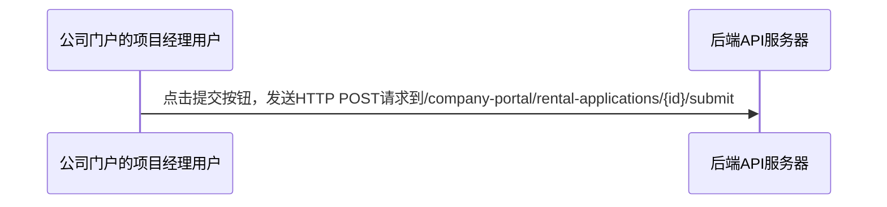
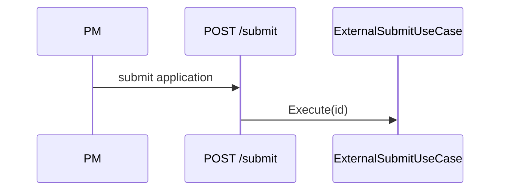

# Spec 写作规范

## 核心原则

Spec 是**实施方案**，不是讨论记录。

| 讨论记录（❌） | 实施方案（✅） |
|---------------|---------------|
| 列出选项 A/B/C，说「选了 B」 | 直接描述 B 的实现方式 |
| 「我们讨论了 X，认为...」 | 「X 的处理方式是...」 |
| D1-D17 平铺决策列表 | 按实施逻辑组织的结构化方案 |
| 大段背景复述 | 精简的问题陈述 |
| 「待定」「后续确认」 | 已决断的结论或明确的范围外 |

## 标准结构

### 必须 section

```markdown
# Spec NN: <简明标题>

## 1. 问题陈述
用 3-5 句话说清楚：现状是什么、问题是什么、影响有多大。

## 2. 目标
一句话：这次改动要达成什么。

## 3. 实施方案
这是 spec 的核心。按实施逻辑组织，不是按讨论顺序。

### 3.1 改动范围
列出要改的文件、类、方法。用表格或列表。

### 3.2 核心流程
用 mermaid 图表展示调用链/状态变化/数据流。

### 3.3 关键实现
代码片段或伪代码，展示核心逻辑。

### 3.4 边界条件
用表格列出所有状态组合及其处理方式。

## 4. 验收标准
可勾选的检查项，分场景测试/回归/手工验证。

## 5. 风险与回退
每个风险配一个具体的回退路径。

## 6. 范围外
明确列出不做的事。
```

### 可选 section

- **背景**：仅当问题需要大量上下文才加，且控制在 5 句内
- **决策记录**：仅当有多个备选方案且需要解释「为什么选这个」时加
- **依赖/前置条件**：仅当实现依赖外部系统或团队时加
- **部署策略**：仅当部署有特殊要求时加

## 图表规范

### 何时用哪种图

| 场景 | 图表类型 | 示例 |
|------|---------|------|
| 调用链/API 流程 | sequenceDiagram | PM 调用 submit → 后端处理 → DB 更新 |
| 分支决策逻辑 | flowchart | 状态检查 → 不同分支处理 |
| 状态变化 | stateDiagram | Draft → Submitted → Approved |
| 数据模型关系 | classDiagram / erDiagram | 实体关系 |

### 图表写作要求

1. **节点/参与者用简短标签**，不用完整句子
2. **边/箭头用动词短语**，说明「做什么」
3. **分支用条件标签**，说明「什么条件」
4. **避免交叉连线**，必要时拆成多张图

### 示例

**❌ 差**


**✅ 好**


## 代码片段规范

1. **只放核心逻辑**，不要完整类文件
2. **标注改动位置**（新增/修改/删除）
3. **省略号表示省略**，不要写完整代码
4. **用注释说明意图**，不是翻译代码

### 示例

**❌ 差**
```csharp
public class ExternalSubmitRentalApplicationUseCase
{
    private readonly IAcceptTermsUseCase _acceptTermsUseCase;
    // ... 50行完整代码
}
```

**✅ 好**
```csharp
// ExternalSubmitRentalApplicationUseCase.Execute 新增逻辑
if (application.Status == Draft && (MD null || TU null))
{
    await acceptTermsUseCase.Execute(id, new AcceptTermsRequest { ... }, creator, ct);
}
// 现有 submit 逻辑不变
```

## 常见反模式

### 1. 聊天记录式

**症状**：D1-D17 平铺列表，像从 Slack thread 摘录的

**修正**：按实施逻辑重组为「改动范围 → 流程 → 实现 → 边界条件」

### 2. 讨论记录式

**症状**：「我们讨论了 A、B、C 三个方案，最终选择了 B，因为...」

**修正**：直接写「方案 B：...」，把「为什么」压缩到一句话

### 3. 未决断式

**症状**：「待定」「后续确认」「实现时再定」

**修正**：要么现在定下来，要么明确写进「范围外」

### 4. 过度背景式

**症状**：背景写了半页，实施方案只有几行

**修正**：背景最多 5 句，实施方案是主体

### 5. 无图式

**症状**：纯文字描述复杂流程，读者需要自己画图才能理解

**修正**：任何涉及 3 个以上步骤或 2 个以上分支的流程，必须有图

## 从讨论到 Spec 的转化流程

当用户给你一个讨论记录或聊天上下文，要转化为 spec 时：

1. **提取决策**：从讨论中提取所有已做的决策
2. **重组结构**：按实施逻辑（不是讨论顺序）组织
3. **补充图表**：把文字描述的流程画成图
4. **删除噪声**：删除讨论过程、选项对比、理由陈述（除非必要）
5. **验证完整性**：检查每个 section 是否可执行、可测试

## 自检清单

写完 spec 后，用这个清单自检：

- [ ] 问题陈述 ≤ 5 句？
- [ ] 目标是一句话？
- [ ] 实施方案有流程图/时序图？
- [ ] 核心逻辑有代码片段？
- [ ] 边界条件是表格？
- [ ] 验收标准可勾选？
- [ ] 没有「待定」「后续确认」？
- [ ] 没有 D1-D17 式平铺列表？
- [ ] 图表节点标签简短？
- [ ] 范围外明确列出？
