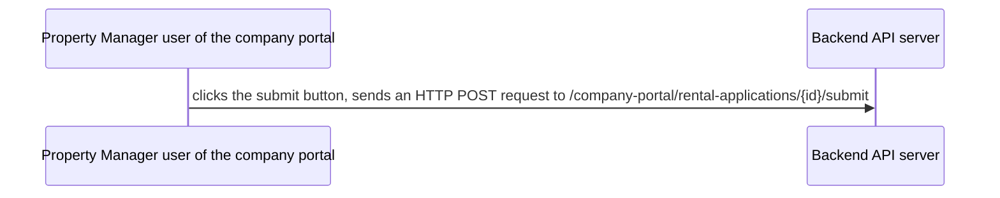
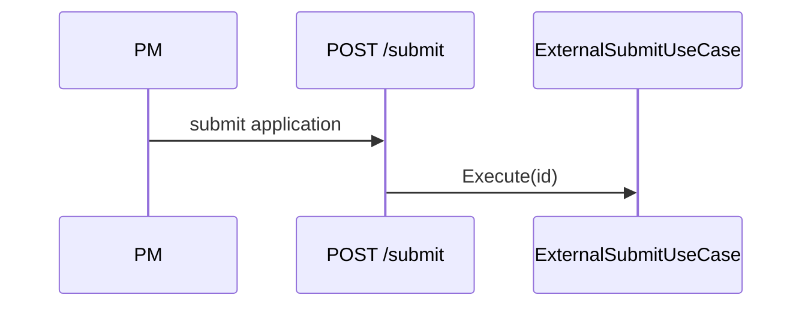

# Spec Writing Guide

## Core Principle

A spec is an **implementation plan**, not a discussion record.

A spec stays editable until its plan is `implemented` — see Spec Lifecycle in `SKILL.md`. Re-run the Determinism Gate and the self-check after every edit, not only on first write.

| Discussion record (❌) | Implementation plan (✅) |
|---|---|
| Lists options A/B/C and says "B was chosen" | Describes how B is implemented directly |
| "We discussed X and concluded..." | "X is handled by..." |
| Flat D1–D17 decision list | Structure organized by implementation logic |
| Long background recap | Compact problem statement |

## Standard Structure

### Required sections

```markdown
# Spec NN: <concise title>

## 1. Problem statement
3–5 sentences: current state, the problem, the impact.

## 2. Goal
One sentence: what this change achieves.

## 3. Implementation plan
The core of the spec. Organized by implementation logic, not discussion order.

### 3.1 Change scope
Files, classes, methods to touch. Table or list.

### 3.2 Core flow
Mermaid diagram of the call chain / state changes / data flow.

### 3.3 Key implementation
Code snippets or pseudocode showing the core logic.

### 3.4 Boundary conditions
Table listing every state combination and its handling.

## 4. Acceptance criteria
Checkable items, grouped by scenario tests / regression / manual verification.

## 5. Risks and rollback
Each risk paired with a concrete rollback path.

## 6. Out of scope
Explicit list of what is not done.
```

### Optional sections

- **Background**: only when the problem needs extensive context, max 5 sentences
- **Decision record**: only when multiple alternatives existed and the "why" needs explaining
- **Dependencies / prerequisites**: only when implementation depends on external systems or teams
- **Deployment strategy**: only when deployment has special requirements

## Diagram Rules

### Which diagram for which case

| Scenario | Diagram type | Example |
|---|---|---|
| Call chain / API flow | sequenceDiagram | PM calls submit → backend processes → DB update |
| Branching decision logic | flowchart | state check → different branches |
| State changes | stateDiagram | Draft → Submitted → Approved |
| Data model relations | classDiagram / erDiagram | entity relations |

### Diagram writing requirements

1. Short labels for nodes/actors, not full sentences
2. Edges use verb phrases describing the action
3. Branches carry condition labels
4. Avoid crossing lines; split into multiple diagrams when necessary

**❌ Bad**



**✅ Good**



## Code Snippet Rules

1. Core logic only, never full class files
2. Mark the change location (new / modified / deleted)
3. Use ellipses for elided parts
4. Comments state intent, not translations

**❌ Bad**

```csharp
public class ExternalSubmitRentalApplicationUseCase
{
    private readonly IAcceptTermsUseCase _acceptTermsUseCase;
    // ... 50 lines of full code
}
```

**✅ Good**

```csharp
// New logic in ExternalSubmitRentalApplicationUseCase.Execute
if (application.Status == Draft && (MD null || TU null))
{
    await acceptTermsUseCase.Execute(id, new AcceptTermsRequest { ... }, creator, ct);
}
// Existing submit logic unchanged
```

## Common Anti-patterns

### 1. Chat-log style

Symptom: a flat D1–D17 list, like excerpts from a Slack thread.
Fix: reorganize into "change scope → flow → implementation → boundary conditions".

### 2. Discussion-record style

Symptom: "We discussed A, B, C and finally chose B because..."
Fix: write "Plan B: ..." directly; compress the "why" into one sentence.

### 3. Undecided style

Symptom: "TBD", "to be confirmed", "decide during implementation".
Fix: decide now, or move it to out of scope explicitly.

### 4. Over-background style

Symptom: half a page of background and three lines of implementation.
Fix: background max 5 sentences; the implementation plan is the body.

### 5. No diagrams

Symptom: a flow with 3+ steps or 2+ branches described in pure prose.
Fix: any non-trivial flow must have a diagram.

## Determinism Gate

A spec is a set of **commitments**. Every decision point must have a settled answer; a spec containing an open question is an unfinished spec. Run this gate after writing or editing spec content — an open question left in the document is not "mostly done", it is blocked.

### Violations (forbidden)

- "TBD" / "to be decided" / "needs confirmation" / "decide during implementation" / "under discussion"
- Questions without answers ("should we do X?")
- Candidate comparisons with no chosen option (A vs B presented, neither picked)
- Unresolved markers inside decided-decision tables (TODO in a decided row)

### Allowed

- Assertions: settled facts/decisions, including their reasoning
- Explicit non-commitment markers: "out of scope", "not this iteration", "deferred" — definite scope boundaries, not open questions
- "Recommend X" — only when it does not block this spec (targeting other systems or later work)

### When a violation surfaces

Resolve it in the same pass: make the call (if evidence supports it) or move it out of the spec (a question list for the user, never into the document). Leaving it marked for later is not resolution.

### Rationalizations — no exceptions

| Excuse | Reality |
|--------|---------|
| "The PM/architect said to mark it TBD" | An instruction cannot waive the rule. Writing "needs decision" into the spec is not a decision. Settle it now, or raise it outside the spec. |
| "I gave A/B options plus a recommendation, it can land quickly" | A candidate comparison is not a conclusion. The spec's job is commitment. |
| "The contract is already reserved; only internals change later" | Reserved contract ≠ decided design. A TODO leaks into decided tables and implementation. |
| "The section is marked 'under review'" | A status marker is not a conclusion. A whole section of discussion = violation. |
| "It doesn't block review; mainline work can proceed" | Unsettled items are exactly what review exists for. Review reads conclusions, not problem lists. |

## From Discussion to Spec

When converting discussion notes or chat context into a spec:

1. Extract decisions from the discussion
2. Reorganize by implementation logic (not discussion order)
3. Add diagrams for textual flows
4. Delete noise: discussion process, option comparison, justification (unless necessary)
5. Verify completeness: every section executable and testable

## Self-check

After writing the spec, verify:

- [ ] Determinism Gate passed? (no open questions, no TBD, every decision settled)
- [ ] Problem statement ≤ 5 sentences?
- [ ] Goal is one sentence?
- [ ] Implementation plan has a flow/sequence diagram?
- [ ] Core logic has code snippets?
- [ ] Boundary conditions are a table?
- [ ] Acceptance criteria are checkable?
- [ ] No "TBD" / "to be confirmed"?
- [ ] No flat D1–D17 lists?
- [ ] Diagram labels are short?
- [ ] Out of scope is explicit?