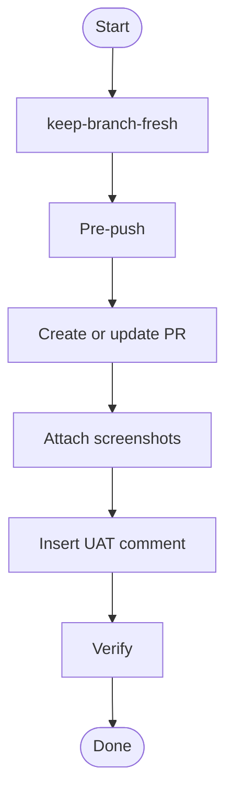

## Overview

Keep branch fresh, run pre-push checks, analyze diff, then create or update PR with complete body, screenshots, and UAT cases.

## When to Use

- Feature branch complete, ready for QA review
- Existing PR needs body update with new changes
- Pre-push checks should run before submitting

## When NOT to Use

- Draft PR still in progress
- Changes not ready for review
- Non-feature branches (chore/refactor)

## Quick Reference

**LMB** (Latest Main Branch) — remote tracking branch ref, e.g. `origin/main`. This is the remote's default branch after fetch. **Always fetch before computing.**

### keep-branch-fresh

**REQUIRED SUB-SKILL:** `keep-branch-fresh`. Always runs first to ensure branch is rebased onto latest main. Stops flow if conflicts unresolvable.

### Pre-push

Probe build system in order: `package.json` → `go.mod` → `Cargo.toml` → `pyproject.toml` → `Makefile` → none. Run standard checks per type.

Failure stops the entire flow.

### Create or update PR

One step that handles PR state check to body creation:

1. **Check PR** — `gh pr view`. No PR / CLOSED → create; OPEN → update.
2. **Analyze** — `git diff origin/$LMB..HEAD`. Single full diff, same for create and update. Used to generate summary and file list.
3. **Body** — Always generate a complete PR body. Probe template: `.github/pull_request_template.md` → `docs/PR_TEMPLATE.md` → `.github/PULL_REQUEST_TEMPLATE.md`. Append: summary + file changes + where-to-test + edge cases.
4. **Push** — `gh pr create` (new) or `gh pr edit --body` (replace entirely).
5. **Link backend dependency (frontend PRs)** — If context (diff, issue, conversation) suggests this frontend PR depends on a backend change (new fields/endpoints, companion backend PR), do BOTH:
   - **Body**: add the backend PR link in clickable Markdown — `[backend PR #NNN](https://github.com/MagicDoorInc/backend/pull/NNN)` — in a visible spot (Related Links / dependency note). Never bare text (`backend PR #NNN`), never backticked code style (`` `https://…` ``), never a relative path (`backend/pull/NNN`).
   - **Label**: `gh pr edit <number> --repo <repo> --add-label "waiting for backend"` — on create AND update.
6. **Assign reviewer (create only)** — Only on new PR; never modify reviewers on update. Map the project to a reviewer: frontend → `keshao728`, backend → `zce`. If it maps to neither, skip and note "assign reviewer manually" in the final summary.

### Attach screenshots

**Goal: embed session screenshots into the PR body.**

Run only when the session already produced UI screenshots (walkthrough/dev captures); skip silently when none exist. Do not stage a capture session just for this step.

**SUB-SKILL:** `attach-pr-images`. Uploads the images and splices them into the body's screenshots section (created if missing). Must run **after** every full body replace — a replaced body wipes previously embedded images, so on update flows this step re-runs after the body step even if the images did not change.

### Insert UAT comment

**Goal: publish UAT cases to the PR as a comment.**

1. **Generate** — **REQUIRED SUB-SKILL:** `pr-uat-case-gen`. Writes `<topic-dir>/uat-cases.uat-case.md` (resolve `<topic-dir>` via the `session-topic` skill's `session-topic.mjs resolve <topic>`).
2. **Post/Patch** — Read the generated file. If non-empty, search PR comments for `<!-- uat-cases -->`; POST if new, PATCH if exists. If empty/missing, skip.

**Must publish.** Do not stop at file generation; `pr-uat-case-gen` alone only writes the file, this step must also publish it.

### Verify

`gh pr view` to confirm PR is created/updated and visible.

## Core Flow

## Common Mistakes

- Skipping keep-branch-fresh when branch is stale → body references outdated code, merge conflicts in review.
- Creating PR before pushing → empty body, broken links (keep-branch-fresh already handles push).
- Skipping pre-push checks under time pressure.
- Not fetching remote before computing LMB (stale local).
- Using wrong LMB when origin HEAD differs from local main.
- Stopping at file generation after `pr-uat-case-gen` without publishing the UAT comment to the PR.
- Creating duplicate UAT comments on the same PR instead of patching the existing one.
- Resetting reviewers on an existing PR — assignment is create-only; update never touches reviewers.
- Attaching screenshots before the body step — a full body replace wipes the embeds; attach after.
- Frontend PR depends on a backend change but ships without the `waiting for backend` label.
- Writing the backend PR link as bare text (`backend PR #NNN`), backticked code (`` `https://…` ``), or a relative path — none are clickable; always `[backend PR #NNN](https://github.com/MagicDoorInc/backend/pull/NNN)`.

## Red Flags

- Skipping keep-branch-fresh to "save time".
- `git push` before pre-push checks.
- Force-push without checking PR state.
- Rebasing without fetching origin HEAD first.
- Skipping UAT with "backend-only" excuse on repos with `.tsx`/`.jsx`.
- Frontend PR touching a not-yet-deployed backend field/endpoint with no backend PR link in the body and no `waiting for backend` label.
