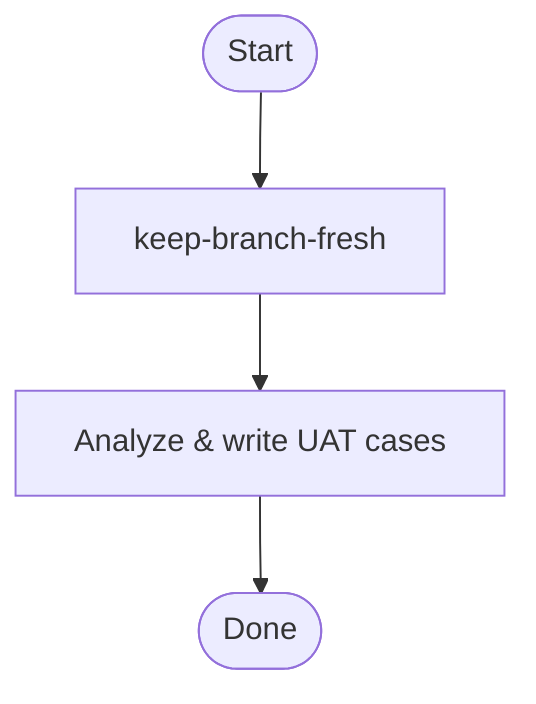

## Overview

Sync branch, analyze diff, generate UAT test cases for frontend feature branches. Each case traces to actual code changes. Output: `$(session-path notes)/uat-cases.md` (never under project `.knowledge/`).

## Quick Reference

**LMB** (Latest Main Branch) — remote tracking branch ref, e.g. `origin/main`. This is the remote's default branch after fetch. **Always fetch before computing.**

### keep-branch-fresh

**REQUIRED SUB-SKILL:** `keep-branch-fresh`. Always runs first to ensure branch is rebased onto latest main. Safe to run even if already synced — no-op when branch is already up-to-date.

### Analyze & write UAT cases

`git diff origin/$LMB..HEAD` — review all changes, identify user-facing scenarios, edge cases, and risk points. Then generate `$(session-path notes)/uat-cases.md`. Up to 10 cases, fewer for small diffs. Each case must trace to an actual code change.

Template:

```
# UAT Test Cases

_Generated by pr-uat-case-gen skill_

## Case N: [title]
**Priority**: P0/P1/P2 | **Module**: [Area]
**Test Steps** / **Expected Results** / **Risk Point** / **Related Code**
```

## Core Flow



## Common Mistakes

- Few focused cases > many weak ones.
- Unrelated files inflate scope; cases not traceable to code change.
- Missing P0 for medium-to-large diff.
- Implementation-oriented cases instead of user-facing scenarios.

## Red Flags

- Copy-paste cases from previous feature.
- Cases that test behavior not yet implemented.
